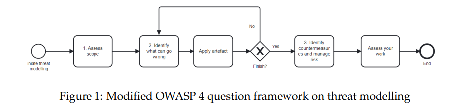

# How the MITRE ATT&CK Framework can be used for Threat Modelling in the Cloud

## 1 Introduction

클라우드 컴퓨팅은 빠르게 인기를 얻고 있는 신흥 기술로, 기업이 업무 속도를 높이고, 비용을 절감하며, 유연성을 향상시킬 수 있도록 돕는다[1]. 최근 클라우드 인프라로 전환하는 추세가 증가하고 있음을 관찰할 수 있다. 가트너(Gartner)의 기사에 따르면, 전 세계 최종 사용자의 클라우드 관련 지출 규모는 작년의 4,910억 달러에서 2023년에는 총 6,000억 달러에 이를 것으로 추정된다[2]. 그러나 클라우드 도입이 급속히 증가하는 속도는 보안 위협 대응 속도를 넘어서는 상황이다. IBM 보고서에 따르면, 데이터 유출로 인한 평균 비용은 전 세계적으로 약 435만 달러이며, 미국에서는 이 비용이 두 배 이상에 달한다. 데이터 유출 사건 중 거의 절반은 클라우드 환경에서 발생하고 있다[3].

클라우드 아키텍처는 상호 연결된 서비스와 다수의 기능이 결합되어 복잡성을 가지고 있으며, 가시성이 부족한 경우가 많아 보안 취약점을 식별하기 어렵다[4]. 2022년 Netwrix가 발표한 클라우드 데이터 보안 보고서에서는 클라우드 도입 과정에서 가장 큰 과제로 기존 IT 환경과의 통합 문제를 지적하였다. 또한 보고서는 "보안 취약점을 수정하기 위한 계획되지 않은 비용 지출"이 데이터 유출 사건의 가장 큰 결과로 나타났으며, 이 비율은 2020년 28%에서 2022년 49%로 증가했다고 밝혔다[1]. 따라서 클라우드 인프라의 보안 상태를 개선하는 데 더욱 중대한 책임이 부여되어야 한다.

### 1.1 Motivation

복잡한 클라우드 환경을 관리하는 것은 어려운 일이며, 이로 인해 다양한 오류와 실수가 발생할 수 있다. AWS를 클라우드 공급자로 사용한 조직에서 잘못 구성된 S3 버킷(데이터 저장소)으로 인해 수백만 명의 사용자에게 영향을 미치는 주요 데이터 유출 사건이 발생한 사례가 있었다[5]. Gartner의 기사에 따르면, 2025년까지 클라우드 보안 실패 사례의 99%는 고객 측의 책임일 것이라고 예상하고 있어[6], 이러한 사건이 발생하는 것은 놀라운 일이 아니다. 클라우드 인프라 초기에 보안 조치를 구현하고 지속적으로 유지하는 것은 공격 표면을 최소화하고 사건 발생을 방지하는 데 도움을 준다. DevSecOps(흔히 shift-left로도 알려짐)는 애플리케이션과 인프라의 보안을 개발 초기에 계획하는 것을 의미한다[7]. Shift-left의 원칙에 따르면 클라우드 환경을 보호하는 데 있어 계획 단계가 매우 중요하다. 배포된 클라우드 워크로드에서 보안 취약점을 자동으로 검사하는 도구를 사용하는 것도 유리하지만, 이러한 검사는 배포 이전, 특히 계획 및 설계 단계에서 수행하는 것이 가장 이상적이다. 이 생애주기에서 주요 구성 요소 중 하나는 규정 준수 모니터링(compliance monitoring)이며, 이는 규정 위반을 조기에 식별하고 적극적으로 대응하는 데 도움을 준다.

본 논문은 위협 모델링(threat modelling)을 통해 안전한 인프라를 계획하고 설계하는 새로운 접근 방식을 탐구하는 것을 목표로 한다. 위협 모델링은 잠재적인 악성 시나리오를 열거하고 이에 대한 대응책을 우선순위화하여 계획 및 설계 단계에서 위협과 취약점을 관리하는 접근법이다. CNAPP는 개발부터 운영 단계까지 클라우드 네이티브 애플리케이션의 전체 생애주기 보호 요구사항을 해결하는 자동화 스캔 도구의 한 유형이다[8]. CNAPP 도구가 생성한 결과물을 활용하여 보안 조치를 왼쪽(초기 단계)으로 이동시키는 위협 모델링 프로세스를 채택할 수 있다.

클라우드 보안에 대한 관심 증가에도 불구하고, 지난 학기에 진행한 체계적 문헌 리뷰(SLR, systematic literature review)에서 밝혀졌듯이 클라우드에서 위협 모델링에 대한 연구는 아직 충분히 이루어지지 않았다(부록 A.1 참조). 사전 연구를 수행하게 된 동기는 이 분야의 미성숙 때문이며, 이는 2021년에 Håkonsen과 Ahmadi가 수행한 이전 SLR에서도 나타난 바 있다[9]. 지난 학기 사전 연구에서 나타난 문제점 중 하나는 클라우드 환경의 가시성 부족, 도구 지원 부족, 현실성 없는 도구였다. 즉, 위협 모델링 수행 시 클라우드 환경에 대한 명확한 개요를 얻기 어려웠다. 또한, 도구 지원 부족으로 인해 실무자들이 클라우드를 위한 제안된 위협 모델링 기술을 채택하는 것이 어려웠다. 도구 지원은 작업 흐름의 일부를 자동화하여 새로운 절차를 더 쉽게 채택할 수 있도록 도와주는 역할을 한다. 일부 기술들이 도구를 포함하고 있었음에도 불구하고, 가이드라인이 너무 추상적이어서 도구의 활용성이 떨어지는 문제가 있었다.

본 석사 논문의 사전 연구에서 확인된 주요 과제 중 하나는 실무자들이 적용 가능하고 실질적인 방식으로 위협 모델링에 자동화 도구를 통합하는 것이다. 클라우드 네이티브 애플리케이션 보호 도구(CNAPP)와 같은 클라우드 도구는 클라우드 인프라를 지속적으로 모니터링하고 위협 및 잘못된 구성을 탐지하여 클라우드 리스크를 식별하고 완화할 수 있다. CNAPP 도구의 세부 내용은 2.4절에서 다룬다. 또한 MITRE ATT&CK 프레임워크는 훌륭한 지식 기반이자 규정 준수 프레임워크로 인식되었으며, 발견된 문제들을 분류하는 데 활용할 수 있을 만큼 정확성이 높은 것으로 나타났다.

### 1.2 Objective and research questions

본 논문의 목적은 자동화 도구를 통해 발견된 보안 결과를 기반으로 클라우드 환경에서 위협 모델링을 수행하는 접근 방식을 정의하는 것이다. 제안된 "shift-left" 접근 방식은 배포 이후 자동화 도구가 탐지한 보안 결과를 효과적인 위협 모델링 전략에 통합하여 활용하는 것이다. 이를 통해 잠재적인 보안 문제를 초기에 식별하고, 사전적으로 대응할 수 있다. 이 전략을 채택하면 개발 생애주기의 초기 단계에서 취약점을 조기에 식별하고 완화할 수 있어 잠재적으로 발생할 수 있는 문제를 예방할 수 있다. 그림 1은 해당 접근 방법이 위협 모델링 세션에서 적용될 수 있는 프로세스를 나타낸다. 예시로 임의의 위협 모델링 방법론인 OWASP의 4가지 질문 프레임워크가 사용된다.

사전 연구에서 본 논문이 기여하고자 하는 이 주제에 대한 연구의 부족이 이미 확인되었다. 본 논문은 본질적으로 다음과 같은 질문에 답하고자 한다: 클라우드 환경에서 취약점을 어떻게 하면 더 이른 단계에서 예방할 수 있을까?

본 논문의 연구 질문은 다음과 같이 요약 및 세부화할 수 있다.

1. RQ1: 배포된 클라우드 인프라에서 도출된 보안 결과가 위협 모델링 프로세스를 어떻게 개선할 수 있는가?
(a) 위협 모델링 세션에서 어떤 질문을 제시할 수 있는가?
2. RQ2: 제안된 해결책의 효과는 무엇인가?
(a) 이 접근법이 문제를 해결하는 데 얼마나 효과적인가?
(b) 이 접근법의 사용성(usability)은 어떠한가?
(c) 요구사항을 얼마나 잘 충족하는가?
(d) 기존의 유사 접근법과 비교하여 어떠한가?
(e) 이 접근법으로 인해 발생할 수 있는 부작용은 무엇인가?

### 1.3 Contribution

본 논문의 기여는 위협 모델링을 통해 클라우드 취약점을 조기에 대응할 수 있도록 설계된 아티팩트(artefact)를 개발하는 것이다. 해당 아티팩트는 CNAPP 도구에 의해 탐지된 인프라의 이전 및 빈번한 문제점들로부터 도출된 일련의 질문들로 구성된다. 이를 통해 팀이 보안 취약점을 조기에 발견하고 식별할 수 있도록 논의를 촉진하고, 필요한 예방 조치를 사전에 적극적으로 취할 수 있도록 하는 것이 목표이다.

### 1.4 Methodology outline

본 논문의 아티팩트 질문 개발 방법론으로 Johanesson과 Perjon의 디자인 사이언스(Design Science) 프레임워크[10]를 사용하였다. 개발된 아티팩트에 대한 평가는 자발적이고 익명의 설문조사를 통해 수행되었다. 기존 클라우드 인프라에 대한 데이터 수집은 노르웨이 소프트웨어 및 정보기술 기업인 Visma와 협력하여 이루어졌다.

### 1.5 Thesis outline

본 논문은 일반적인 위협 모델링, 지난 학기의 사전 연구, 클라우드 환경에서의 위협 모델링 및 CNAPP 도구와 관련된 배경을 제시하는 챕터로 구성되어 있다. 다음 장에서는 본 연구에서 사용된 방법론을 자세히 설명하고, 수행된 주요 활동을 서술한다. 이어지는 장에서는 개발된 아티팩트가 어떻게 구현되었는지와 이를 시뮬레이션을 통해 위협 모델링에 적용하는 방법을 설명한다. 다음 장에서는 피드백 설문조사를 통해 얻은 평가 결과를 제시하고, 이어서 평가 결과에 대한 논의를 진행한다. 마지막으로 결론과 향후 연구 및 작업에 대한 시사점을 제시하며 논문을 마무리한다.

## 2 Background

본 장에서는 본 논문의 연구와 관련된 충분한 배경과 맥락을 제공한다. 먼저 일반적인 위협 모델링에 대한 배경을 제시한 후, 지난 학기에 진행된 사전 연구에 대해 설명하고 클라우드 환경에서의 위협 모델링을 다룬다. 다음으로 CNAPP 도구에 관한 설명이 이어진다.

### 2.1 Threat modelling

위협 모델링은 잠재적인 위협과 취약점을 조기에 식별하고 관리하기 위한 프로세스로, 개발 생애 주기의 각 단계에서 수행된다. 『Threat modelling: Designing for Security』의 저자 Johanesson은 위협 모델링을 주요 활동을 세부 목표로 나누어 각 단계에서 목표를 달성하는 방식으로 설명한다[11]. 각 단계에서 목표를 달성하면 공격 표면을 점진적으로 줄이고 새롭게 나타나는 문제를 해결할 수 있다. 위협 모델링을 수행하는 방법은 다양하며, 전체 프로세스를 수행하거나 일부 기술만을 선택하여 적용할 수도 있다. 대표적인 기술로는 STRIDE[12], PASTA[13], Trike[14] 등이 있다. 위협 모델링의 주요 목적은 시스템의 설계 및 개발 단계에서부터 보안을 고려하도록 팀을 독려하여, 보다 안전하고 신뢰할 수 있는 시스템을 구축하는 데 있다.

### 2.2 Pre-study on Threat modelling in Cloud

이전의 체계적 문헌 리뷰(SLR) 중 Tuma 외 연구자들[16]과 Håkonsen 및 Ahmadi[9]는 클라우드 위협 모델링 기법의 부족을 향후 연구의 과제로 지적하였다. 이에 본 연구의 목적은 클라우드 영역에서 현재 사용되는 방법 및 도전 과제를 조사하고 이해하여 클라우드 위협 모델링 개선 가능 분야를 식별하는 데 있다. 이를 달성하기 위해 지난 학기에는 클라우드 환경에서 위협 모델링에 관한 체계적 문헌 리뷰를 수행하였다(부록 A.1 참조). 이 체계적 문헌 리뷰는 Tuma 외 연구자들[16] 및 Håkonsen과 Ahmadi[9]의 SLR을 기반으로 확장한 것으로, 그들의 연구 전략을 따르되 클라우드 영역에만 집중하여 필터링하였다. 2013년부터 2021년 사이 Tuma 외 연구자들과 Håkonsen 및 Ahmadi의 논문에서 총 6개의 기법이 도출되었다. 추가로 2021년부터 2022년 사이 사전 연구에서 새로운 기법 5개가 추가로 발견되어, 클라우드 환경의 위협 모델링 분야에 유망한 추세가 있음을 나타냈다. 그러나 연구 표본 크기가 작아 아직 명확한 결론을 내리기에는 이르며, 이 분야는 더 성숙할 시간이 필요하다. 도출된 기법 중 약 절반은 도구의 지원을 받았다. 일부 기법은 도구가 포함되었음에도 불구하고 명확하지 않은 지침과 일정 수준 이상의 사전 보안 지식 요구로 인해 실무자들이 적용하기 어려웠다. 또한 위협 모델링의 입력 표현(주로 모델 기반 또는 텍스트 기반 설명)은 클라우드 환경을 체계적이고 구조적으로 표현하는 방식이 부족하여 클라우드 인프라의 일관된 가시성을 확보하는 것이 어려웠다. 결론적으로, 연구에서 발견된 기법들은 아직 미성숙하여 실제 적용 가능성을 확보하기 위한 추가 연구가 필요하다는 점이 확인되었다.

### 2.3 Threat modelling in cloud

클라우드 컴퓨팅 기술은 지난 몇 년 동안 급속한 성장을 경험하고 있다. Gartner 보고서에 따르면, 클라우드 최종 사용자의 규모는 2020년 2,700억 달러에서 3,323억 달러로 23.1% 증가할 것으로 예측하고 있다[2]. 많은 산업들이 여전히 클라우드 기반 인프라로 전환 중이며, 향후 시장 규모는 더욱 확대될 것으로 예상된다. 클라우드 컴퓨팅 분야가 계속 성장함에 따라 공격 표면(attack surfaces) 역시 증가하고 있다. 이에 따라 클라우드 인프라의 보안 상태를 개선하는 책임이 더욱 커지고 있다. 대부분의 클라우드 보안 사고는 잘못된 구성(misconfigurations)에서 비롯되며[6], 이는 초기에 예방할 수 있는 문제들이다. 따라서 위협 모델링은 이러한 문제를 조기에 식별하는 데 적합한 프레임워크이다.

클라우드 환경에서의 주요 과제 중 하나는 소프트웨어 애플리케이션의 개발 및 배포 속도가 매우 빠르다는 것이다. 지속적인 통합(CI) 및 지속적인 배포(CD)의 속도가 빠르게 진행됨에 따라 보안 문제가 간과되는 경우가 많다[17]. Younas 외 연구자들은 클라우드 컴퓨팅의 주요 장애물 중 하나로 보안 위협을 제기한다[18]. Ghani 외 연구자들은 안전한 소프트웨어 개발을 위한 역할과 책임을 논의하며, 애자일(agile) 개발에서 보안 전문가를 참여시키는 것이 오버헤드로 여겨진다고 지적한다[19]. 따라서 개발 주기 초기에 보안을 통합하는 ‘Shift-left’ 개념이 널리 논의되고 있으며, 이는 개발 주기를 시계 방향으로 이동시키는 것으로 시각화할 수 있다. 이 접근법은 보안 및 정책 구현을 코드 배포 전인 설계 단계부터 적용하도록 제안한다. 빠른 소프트웨어 개발 속도를 따라잡기 위해 이 접근법은 매우 중요하다[17].

이 문제를 효과적으로 해결하기 위해서는 클라우드 인프라를 모니터링, 탐지, 관리 및 자동화하기 위한 애플리케이션에 더 많은 자동화와 보안, 네트워크 기능을 통합하는 것이 필수적이다. 본 논문은 자동화된 스캔 도구의 보안 결과를 결합하여 클라우드 환경에서 위협 모델링 관점의 ‘Shift-left’ 접근 방식을 탐구하는 데 중점을 둔다. 또 다른 주요 과제는 클라우드 환경의 상호 연결된 서비스와 자원으로 인한 복잡성이다. 이는 다양한 상호 연결된 서비스 간에 제공되는 수많은 기능으로 인해 복잡성을 크게 증가시키기 때문이다. 자동화된 스캔 도구가 필요한 이유는 시스템에서 수동으로 이러한 문제를 탐지하는 것이 매우 어렵고 시간이 많이 소요되기 때문이다. 본 논문은 개발 주기에서 보안을 초기에 통합하려는 목표를 달성하기 위해 CNAPP 도구의 결과를 활용할 것이다.

### 2.3.1 Cloud computing

미국 국립표준기술연구소(NIST)는 클라우드 컴퓨팅에 관한 표준 및 가이드라인을 제정하였다. NIST에 따르면 클라우드 컴퓨팅 기술은 자원과 메모리 공간 등을 사용자가 구성하여 제어할 수 있는 광범위한 컴퓨팅 역량을 제공하며, 어디서나 접근 가능한 네트워크 환경을 제공해야 한다. 서비스 및 자원 프로비저닝은 별도의 관리나 번거로움 없이 신속하게 이루어지고 즉각적으로 배포 가능하다. 또한 클라우드 컴퓨팅의 다섯 가지 필수적인 특징은 주문형 셀프 서비스(On-demand self-service), 광범위한 네트워크 접근(broad network access), 자원 공유(resource pooling), 신속한 확장성(rapid elasticity), 측정 가능한 서비스(measured service)로 정의할 수 있으며, 다음과 같은 기능을 제공한다.

- 수요에 따라 자원을 확장하고 이에 맞게 비용을 지불할 수 있는 유연성
- 광범위한 네트워크 접근성 제공
- 자원의 원활한 배포를 통해 인프라 구축, 관리 및 운영에 소요되는 비용과 노력을 최소화하여 IT 환경을 효율적으로 운영 가능

클라우드 컴퓨팅의 서비스 모델은 SaaS(Software as a Service), PaaS(Platform as a Service), IaaS(Infrastructure as a Service)로 구성된다. 배포 모델은 프라이빗 클라우드, 커뮤니티 클라우드, 퍼블릭 클라우드 및 하이브리드 클라우드를 포함한다. 선택된 서비스 및 배포 모델에 따라 제어 권한과 가시성이 달라지며, 이는 클라우드 환경에 여러 복잡성 계층을 추가하게 된다. 사전 연구(부록 A.1 참조)에서 지적된 한 가지 한계점은 다양한 요소와 구성 요소가 관련된 클라우드 환경에서 전반적인 가시성을 확보하기가 어렵다는 점이다. 다음 절에서는 엔지니어의 책임 증가와 클라우드 환경의 가시성 문제에 대해 보다 자세히 논의할 것이다.

### 2.3.2 Cloud Native

클라우드 네이티브 기술은 조직이 클라우드 컴퓨팅 환경에 적응할 수 있도록 클라우드 네이티브 컴퓨팅 재단(CNCF)에 의해 정의되었다. 여기에는 컨테이너, 서비스 메시(service meshes), 마이크로서비스(microservices), 불변 인프라(immutable infrastructure), 선언적 API(declarative APIs)를 포함한 다양한 기술과 서비스가 포함된다. 이 기술의 목표는 동적인 클라우드 환경 내에서 확장성(scalability), 탄력성(elasticity), 복원력(resiliency), 유연성(flexibility)을 향상시키는 것이다[21]. 이러한 기능들은 개발 주기를 가속화하고 빠른 배포를 가능하게 한다. 하지만 이러한 이점을 활용할수록 엔지니어에게 요구되는 책임 역시 크게 증가한다. 엔지니어는 각 서비스를 정확하게 구성하고 보안성을 확보하기 위해 각 서비스에 대한 충분한 지식을 갖추어야 한다.

과거에는 모놀리식(monolithic) 애플리케이션이 표준이었지만, 클라우드 네이티브 설계 방식이 전통적인 접근 방식을 대체하는 추세로 자리 잡고 있다[22]. 그림 2와 그림 3은 두 가지 설계 방식의 차이를 나타낸다. 모놀리식 애플리케이션에서는 모듈들이 보다 긴밀하게 결합되어 있으며, 클라이언트와 모듈 간의 통신 흐름이 보다 직접적이고, 그 후 데이터베이스로 요청이 전송된다. 클라우드 네이티브 애플리케이션에서는 모든 요청이 API 게이트웨이라는 단일 진입점을 통해 전달된 후, 지정된 마이크로서비스로 리디렉션된다. 이후 요청은 이벤트 버스(event bus)에 전달된다. 이벤트 버스는 구성 방식에 따라 특정 작업을 계속 수행한다. 이와 같은 비동기 이벤트 중심 아키텍처(asynchronous event-driven architecture)는 상호 연결된 마이크로서비스를 하나로 묶어주는 클라우드 네이티브 기술의 핵심이 된다.

클라우드 컴퓨팅은 많은 이점을 제공하지만, 클라우드 자원의 특성과 상호작용 방식에 대한 학습 곡선이 존재한다. 자원이 상호 독립적으로 분리되어 있으므로 각각의 자원을 개별적으로 보호해야 한다. 이는 안전한 클라우드 인프라를 설계할 때 반드시 고려해야 할 사항이다.

### 2.4 Cloud-Native Application Protection Platform (CNAPP)

클라우드 네이티브 애플리케이션 보호 플랫폼(CNAPP)은 클라우드 인프라를 지속적으로 모니터링하고 위협 및 잘못된 구성을 탐지하여 클라우드 환경(IaaS, SaaS, PaaS 등)의 위험을 식별하고 완화하는 과정을 자동화한다. CNAPP 도구는 클라우드 인프라를 산업 표준 또는 모범 사례와 비교하여 규정 준수를 보장한다. 이 도구는 클라우드 보안 상태를 개선하기 위한 중요한 역할을 하며, 잘못된 구성을 탐지하고 수정하는 방식으로 'Shift-left'를 구현하는 데 도움을 준다[23]. CNAPP 도구가 제공하는 주요 기능은 다음과 같다[24].

- 제어(Control)
• 규정 준수 보장(Compliance assurance)
• 모니터링(Monitoring)
• 통찰력 및 가시성(Insight and visibility)

제어(Control): 동적으로 변화하는 클라우드 환경에서도 현재 서비스와 자원이 지속적으로 규정을 준수하도록 하는 역할을 한다. 이러한 정책은 다양한 관리 그룹, 구독(subscription), 테넌트(tenant)의 구체적인 요구사항에 맞게 수정 및 조정이 가능하여 규정 준수를 보다 유연하게 유지할 수 있다.

규정 준수 보장(Compliance assurance): 현재 시스템 및 기존 플랫폼과 통합 및 구성하여 조직이 산업 표준에 따른 규정 준수를 유지할 수 있도록 한다. 이러한 통합을 통해 위협을 자동으로 식별하고 조사하며 완화하기 위한 권장 조치를 제공한다.

모니터링(Monitoring): 클라우드 환경을 지속적으로 스캔하여 위협을 탐지한다. 이를 통해 조직은 특정 자원 요구사항에 따라 맞춤형 구성을 적용하여 보안 접근 제어 조치를 강화하고 완화 전략을 효과적으로 관리할 수 있다.

통찰력 및 가시성(Insight and visibility): 자원의 현재 상태에 대한 깊이 있는 분석과 개선을 위한 권장사항을 제공한다. 포괄적인 분석과 스캔을 통해 다양한 위험 요소를 식별하고 연결함으로써 공격 표면을 줄이고 클라우드 환경에 대한 가시성을 높인다.

사전 연구 결과, 클라우드 환경에 대한 가시성이 부족하고 위협 모델링을 위한 도구 지원이 미흡한 것으로 나타났다. 본 논문의 목적은 CNAPP 도구를 사용하여 데이터를 수집하고 분석한 후 이를 위협 모델링 프로세스에 통합하여 이 문제를 해결하는 것이다. 이 도구의 활용은 클라우드 위협 모델링에서 초기에 보안 관점을 집중시키는 방안으로 간주될 것이다.

### 2.4.1 MITRE ATT&CK compliance

MITRE ATT&CK은 사이버 공격자의 다양한 공격 단계와 생애 주기에서 실제로 관찰된 사례를 바탕으로 악성 행위를 탐지하기 위해 설계된 체계화된 지식 기반이다. 이 프레임워크는 공격의 탐지와 대응을 개선하는 데 도움을 준다. MITRE ATT&CK은 크게 Tactics(전술), Techniques(기법), Procedures(절차)로 구성된다. 전술은 공격의 목적을 나타내며, 기법은 전술을 수행하기 위한 구체적인 방법을 제시하고, 절차는 기법을 더욱 심도 있고 상세하게 설명한다. 이 지식 기반은 배경 지식에 관계없이 누구나 쉽게 접근할 수 있으며, 최신 보안 이벤트를 지속적으로 업데이트하여 발전하는 공격 기술에 대한 이해를 높인다. 사전 연구의 결과로, MITRE 프레임워크를 사용하는 기법이 높은 정확도를 나타냈으며, 클라우드 위협 모델링의 문제들을 효과적으로 분류하는 데 활용 가능한 것으로 나타났다.

## 3 Research Methodology

본 논문은 1장에서 제시된 연구 질문에 따라 클라우드 환경에서의 위협 모델링을 위한 접근 방식을 정의하기 위한 목적으로 수행되었다. 이를 위해 디자인 사이언스 방법론을 적용하였다. 연구 전략은 여러 주요 단계로 구성되며, 이어지는 하위 섹션에서는 각 단계에 대한 간략한 개요와 이들이 전체 방법론 프레임워크에서 어떤 역할을 하는지 설명한다.

### 3.1 Design science

디자인 사이언스(Design Science)의 핵심 요소는 실천(practice), 사람(people), 문제(problem)를 포함한다. 여기서 실천이란 개인이 실질적인 문제를 해결하기 위해 정기적으로 수행하는 일련의 활동을 의미한다. 이 절차는 일련의 단계로 나눌 수 있다. 디자인 사이언스는 일반적인 관심을 갖는 실질적인 문제를 해결하기 위해 사람들이 개발하고 사용하는 아티팩트(artefact)를 만들고 활용하는 것이다[10]. 디자인 사이언스는 문제 영역 내에서 해결책의 일반화 가능성을 고려한다. 이는 디자인 사이언스로부터 도출된 결과가 보다 광범위한 글로벌 맥락에서 적용될 수 있음을 의미한다. 또한 디자인 사이언스는 연구 지식을 더 넓은 연구 커뮤니티와 공유하는 것을 강조한다[10].

디자인 사이언스는 방법론을 체계적이고 엄격한 방식으로 수행할 것을 요구하며, 이를 통해 연구의 재현성을 보장하고 반복적 학습을 통해 지식을 촉진할 수 있도록 한다. 연구 결과를 실무자와 연구자 모두에게 배포하고 공유하는 것도 분야에서 동등하게 중요하다. 출판물은 연구 결과를 전달하는 주요 수단이다. 연구 방법론을 투명하고 접근 가능하게 만듦으로써 다른 연구자들이 이를 적용하고 반복 학습을 통해 지식을 축적할 수 있게 한다. 마지막으로 본 논문의 연구 방법론은 체계적이고 엄격한 방식으로 수행되어 연구의 재현성을 보장할 뿐 아니라 반복적 학습을 통해 지식을 촉진할 수 있도록 설계되었다. 실무자와 연구자 모두에게 결과를 배포하고 공유하는 것이 이 분야에서 중요하며, 출판을 통해 결과를 전파한다. 연구 방법론을 투명하고 접근 가능하게 하면, 다른 연구자들도 이를 참고하여 지식을 축적할 수 있다.

### 3.2 Design Science Research Strategy

Johanneson과 Perjons [10]이 발표한 디자인 사이언스(Design Science) 프레임워크는 다음과 같은 다섯 가지 주요 활동으로 구성되어 있다. 문제 정의(explicate problem), 요구사항 정의(define requirements), 아티팩트 설계 및 개발, 아티팩트 시연, 아티팩트 평가로 구성된다. 이 절차는 여러 주요 단계로 이루어져 있으며, 이후 하위 섹션에서는 각 단계의 개요와 방법론 프레임워크 내에서의 역할을 간략히 설명한다.

디자인 사이언스의 핵심 요소는 실천(practice), 사람(people), 문제(problem)로 이루어진다. 여기서 실천(practice)이란 개인들이 실질적인 문제를 해결하기 위해 정기적으로 수행하는 활동을 의미한다. 프로세스는 아티팩트를 개발하고 활용하는 사람들에 의해 일반적인 관심사인 실제 문제를 해결하는 것을 목표로 한다[10]. 디자인 사이언스는 문제 영역에서 해결책의 일반화 가능성을 고려하며, 이는 디자인 사이언스에서 도출된 결과가 더욱 광범위한 글로벌 맥락에서도 적용 가능함을 의미한다. 또한 디자인 사이언스는 지식을 더 넓은 연구 커뮤니티와 공유하는 것을 강조한다.

디자인 사이언스의 핵심은 연구 방법론을 체계적이고 엄격하게 수행하여 연구의 재현성을 보장하고, 반복적 학습을 통해 지식을 촉진하는 것이다. 연구 결과를 실무자와 연구자 모두에게 전파하고 공유하는 것이 중요하며, 출판은 연구 결과를 전달하는 중요한 수단이다. 연구 방법론을 투명하고 접근 가능하게 만들어, 다른 연구자들이 이를 적용하고 반복적 학습을 통해 지식을 축적할 수 있도록 한다. 이 논문의 연구 방법론은 체계적이고 엄격하게 수행되어 연구의 재현성을 보장하며, 반복적 학습을 통해 지식을 촉진하도록 설계되었다. 실무자와 연구자 모두에게 결과를 배포하고 공유하는 것이 중요하며, 출판물을 통해 연구 결과를 효과적으로 전달한다.

이 논문의 연구 방법론은 지난 학기 2.2절에서 수행된 사전 연구(pre-study)를 통해 문제 명세화와 필요한 요구사항을 명확하게 파악함으로써 크게 기여하였다.

Explicate problem

Johanneson과 Perjons [10]에 따르면 문제(problem)는 현재 상태와 바람직한 상태 사이의 격차를 의미한다. 따라서 목표는 부족한 부분이 무엇인지 명확하게 정의하고, 이 격차를 일으키는 요인을 파악하는 것이다. 이를 위해 독자가 문제를 새로운 관점에서 이해할 수 있도록 맥락을 제공하는 것이 중요하다. 문제는 지나치게 구체적이거나 전문적인 영역에 국한되지 않고, 오히려 더 넓은 독자층의 관심을 끌 수 있도록 제시되어야 한다.

문제를 조사할 때 중요한 조건 중 하나는 근본 원인 분석(root cause analysis)을 수행하는 것이다. 이는 표면적인 문제를 넘어 문제의 범위를 이해하기 위해 문제의 근본적인 원인을 조사하는 과정을 포함한다. 근본 원인을 식별하고 분석함으로써 문제에 대한 깊은 통찰을 얻을 수 있다. 프레임워크의 첫 번째 단계는 문제의 중요성을 정당화하고 근본 원인을 조사하여 문제를 최대한 정확하게 정의하는 것이다. 이 단계는 후속 활동의 토대를 마련하고, 다음 단계에 대한 입력 자료를 제공한다. 이 단계의 주요 하위 활동은 다음과 같이 세분화될 수 있다.

1. 문제 정의
2. 문제의 정당성 설명
3. 문제의 근본 원인 식별

문제를 정확하게 정의하면 잘못 해석될 위험을 줄이고 문제에 대한 공통된 관점을 형성할 수 있다. 그러나 지나치게 추상화하면 이해하기 어려워 중요한 측면과 세부 사항을 놓칠 수 있다. 이러한 위험을 완화하기 위해 다양한 이해관계자들을 논의에 참여시키는 것이 유효하다. 이를 통해 문제에 대한 공통적인 이해를 형성할 수 있다.

또한 문제를 적절히 위치시키고 정당성을 설명하는 것도 중요하다. 이는 문제를 관련된 맥락에 통합하여 왜 이 문제를 해결해야 하는지를 이해하도록 돕는 과정이다. 효과적인 접근 방법은 이해관계자, 관련 활동 및 주변 환경과 같은 다양한 요소를 고려한 실무적 관점에서 문제를 보는 것이다. 이러한 맥락적 정보를 제공함으로써 타인이 문제의 중요성을 이해할 수 있도록 돕는다.

마지막으로, 문제의 근본 원인을 식별, 분석하여 시각적으로 제시하는 것도 효과적이다. 예를 들어 근본 원인을 시각화하여 나타내는 다이어그램을 활용할 수 있다.

Requirement elicitation

요구사항 정의의 목표는 개발될 아티팩트(artefact)의 청사진을 마련하는 것이다. 이를 위해서는 우선 생성할 아티팩트의 유형, 예를 들어 구성요소(construct), 모델(model), 방법(method), 혹은 인스턴스화(instantiation)를 결정해야 한다. 유형이 결정되면 이해관계자에게 중요한 필수 요구사항을 도출하는 단계가 이어진다. 요구사항은 아티팩트가 가져야 할 바람직한 특성이나 속성으로 볼 수 있다. 이러한 요구사항은 기능적(functional), 구조적(structural), 환경적(environmental), 비기능적(non-functional) 요구사항 등으로 다양하게 나눌 수 있다.

Design and develop artefact

요구사항 정의의 목표는 개발될 아티팩트(artefact)의 청사진을 마련하는 것이다. 이를 위해서는 우선 생성할 아티팩트의 유형, 예를 들어 구성요소(construct), 모델(model), 방법(method), 혹은 인스턴스화(instantiation)를 결정해야 한다. 유형이 결정되면 이해관계자에게 중요한 필수 요구사항을 도출하는 단계가 이어진다. 요구사항은 아티팩트가 가져야 할 바람직한 특성이나 속성으로 볼 수 있다. 이러한 요구사항은 기능적(functional), 구조적(structural), 환경적(environmental), 비기능적(non-functional) 요구사항 등으로 다양하게 나눌 수 있다.

이 활동은 아티팩트를 설계하고 개발하는 과정에 초점을 맞추며, 이전 단계에서 도출된 입력을 바탕으로 구체화된다. 과정은 '구상 및 브레인스토밍(Imagine and brainstorm)', '평가 및 선택(Assess and select)', '스케치 및 구축(Sketch and build)', '정당화 및 성찰(Justify and reflect)'의 단계로 나뉘며, 각각이 아티팩트의 설계 및 생성에 기여한다.

'구상 및 브레인스토밍' 단계에서는 아이디어를 개인적으로 또는 그룹 내에서 브레인스토밍 세션, 워크숍, 인터뷰 등의 다양한 방법을 활용하여 생성한다. 이후, '평가 및 선택' 단계에서 생성된 아이디어를 평가하고 최적의 선택지를 선별하여 다음 단계로 진행한다. 이 과정은 솔루션 공간을 좁히고, 정의된 요구사항과 잘 맞는 가장 실행 가능한 옵션에 집중하는 데 도움을 준다.

아이디어가 평가 및 선택된 후에는 '스케치 및 구축' 단계가 시작된다. 이 단계에서는 선정된 아이디어를 기반으로 아티팩트를 설계하며, 이를 위해 유스 케이스 다이어그램(use case diagram), 사용자 스토리(user story), 스토리보드(storyboarding) 등의 방법을 활용할 수 있다.

마지막 단계인 '정당화 및 성찰'에서는 설계 논리를 제공하는 데 중점을 둔다. 설계 논리는 아티팩트의 설계 결정에 대한 사고 과정과 이해를 전달하는 데 도움을 준다.

Demonstrate artefact
다음 단계는 아티팩트가 특정 사용 사례에 어떻게 적용되고 검증되는지를 다루며, 앞서 설명된 문제를 해결하는 과정에서 아티팩트가 어떻게 활용될 수 있는지를 보여준다. 이는 사용 사례에서 아티팩트가 얼마나 효과적으로 작동하는지를 기술적 지식(descriptive knowledge)의 측면에서 평가할 뿐만 아니라, 아티팩트가 왜 효과적인지를 설명적 지식(explanatory knowledge)의 관점에서도 측정하는 것을 목표로 한다. 하위 활동으로는 적절한 사용 사례를 선택하고 이를 적용하여 시연하는 과정이 포함된다.

Evaluate artefact

다음 단계는 아티팩트가 특정 사용 사례에 어떻게 적용되고 검증되는지를 다루며, 앞서 설명된 문제를 해결하는 과정에서 아티팩트가 어떻게 활용될 수 있는지를 보여준다. 이는 사용 사례에서 아티팩트가 얼마나 효과적으로 작동하는지를 기술적 지식(descriptive knowledge)의 측면에서 평가할 뿐만 아니라, 아티팩트가 왜 효과적인지를 설명적 지식(explanatory knowledge)의 관점에서도 측정하는 것을 목표로 한다. 하위 활동으로는 적절한 사용 사례를 선택하고 이를 적용하여 시연하는 과정이 포함된다.

최종 단계의 주요 목표는 아티팩트가 문제를 얼마나 효과적으로 해결하는지와 요구사항을 어느 정도 충족하는지를 평가하는 것이다. 평가는 다음 여섯 가지 목표를 통해 이루어진다.

- 문제 해결 효과성 평가
• 요구사항 충족도 평가
• 사용성 평가
• 아티팩트 비교
• 부작용 조사
• 형성적 평가

### 3.2.1 Explicate problem

클라우드 컴퓨팅 시장의 확장을 이해하는 것은 클라우드 관련 문제를 해결해야 하는 이유를 인식하는 데 중요한 요소이다. 2022년 4,910억 달러에서 2023년 거의 6,000억 달러에 이를 것으로 예상되며, 이는 21.7%의 성장률을 나타낸다[2]. 이러한 성장은 기업들이 점점 더 클라우드 서비스를 채택하고 있음을 의미하며, 이에 따라 클라우드 취약점과 공격 표면도 증가하고 있다. 결과적으로 이러한 요구를 충족하기 위해 사이버 보안 서비스에 대한 수요도 급증할 것으로 예상된다.

Problem definition

잠재적 위험을 완화하기 위해서는 개발 주기의 초기 단계에서 보안 마인드를 수용하고, 사전 예방적 접근 방식을 채택하는 것이 중요하다. 이러한 보안 중심 접근 방식의 대표적인 사례가 위협 모델링(threat modelling)이다. 개발 프로세스에 위협 모델링을 통합하면 보안 취약점을 사전에 예방할 수 있으며, 문제가 발생한 후 탐지하고 대응하는 방식보다 더욱 효과적인 보안 조치를 가능하게 한다.

2.2절에서 설명한 바와 같이, 지난 학기에 클라우드 환경에서의 위협 모델링을 주제로 체계적 문헌 검토(systematic literature review)를 수행하였으며, 주요 연구 결과 중 하나는 도구 지원 부족과 해당 도구들의 실효성 문제였다. 현재 산업에서 활용되는 도구들은 시스템을 스캔하여 광범위한 취약점 식별 및 개요를 제공할 수 있다. 그러나 이러한 애플리케이션 대부분은 네트워크 및 웹 애플리케이션 보안에 초점을 맞추고 있으며, 클라우드 인프라에 대한 고려는 미흡한 실정이다.

2.4절에서 언급된 CNAPP 도구들은 이러한 문제를 해결할 가능성이 있는 유망한 솔루션으로 보인다. 그러나 클라우드 도구가 보안 문제를 식별하는 데 얼마나 효과적인지에 대한 연구 출판물은 명백히 부족하며, 특히 다른 보안 분야와 비교했을 때 더욱 두드러진다[26][27]. 따라서, 현재의 바람직하지 않은 상태는 CNAPP 도구에 대한 연구 부족으로 정의될 수 있으며, 바람직한 상태는 이러한 도구들을 새로운 맥락에서 활용할 수 있는 혁신적인 접근 방식을 탐색하는 것이다. 이를 통해 사전 연구에서 강조된 향후 연구 과제 중 일부를 해결할 수 있으며, 본 논문에서는 이를 바탕으로 아티팩트의 개념을 제안하고자 한다.

이후 장에서는 본 논문에서 제안하는 아티팩트의 세부적인 탐색과 이를 통해 현재와 바람직한 상태 간의 격차를 해소하는 역할에 대해 자세히 논의할 것이다.

Justifying importance

현재 문제 정의는 아직 명확하지 않으며, CNAPP 도구와 관련된 다양한 연구 영역을 포함할 수 있다. 따라서 연구 범위를 더욱 좁히는 것이 필요하다. 핵심 질문은 이러한 도구를 활용하여 클라우드 문제를 효과적으로 탐지하는 방법이다. 자동화된 스캐닝 도구는 사전에 탐지가 어려운 다수의 보안 문제를 식별할 수 있다. 중요한 점은 이를 개발 주기의 초기 단계로 "Left Shift"하는 것이다. 따라서, 문제의 구체적인 정식화는 다음과 같이 수정될 수 있다: "클라우드 취약점을 더 이른 단계에서 탐지할 수 있는가?"

"이른 단계"는 CNAPP 도구를 활용하여 탐지된 클라우드 취약점을 위협 모델링과 결합하여 적용하는 것을 의미한다. 결과적으로, 이는 클라우드 환경에서의 위협 모델링 성숙도를 향상시키는 역할을 할 것이다. 따라서 문제 정의에 대한 제안된 해결책은 CNAPP 도구를 위협 모델링 프로세스에 통합하는 것이다.

이후 장에서는 본 논문에서 제안하는 아티팩트의 세부적인 탐색과 이를 통해 현재와 바람직한 상태 간의 격차를 해소하는 역할에 대해 자세히 논의할 것이다.

Root cause analysis

Ishikawa fishbone 다이어그램을 기반으로 한 품질 관리 관점의 근본 원인 분석(root cause analysis)을 클라우드 컴퓨팅에 적용하여 수행하였다[28]. 분석에 사용된 주요 범주는 사람(People), 프로세스(Process), 기술(Technology), 환경(Environment), 그리고 제삼자(Third party)이다. 일부 원인은 사전 연구와 Visma의 인프라 엔지니어, 아키텍트 및 지도 교수와의 정기적인 회의를 통해 도출되었으며, CNAPP 도구에서 제공된 주요 결과를 간략히 검토한 내용도 포함되었다.

추가적인 범주로서 제삼자(Third party)는 클라이언트 측 관점을 강조한다. 클라우드 공급업체가 보안 사고의 영향을 받을 경우, 클라이언트 또한 영향을 받을 수 있기 때문에 클라우드 공급업체를 제삼자 행위자로 포함하였다. 또한, 내부 팀 내의 위협(insider threats) 및 제삼자 계약을 통한 소프트웨어 공급망 침해는 클라우드 취약점을 유발할 가능성이 있으며, 대표적으로 구식 소프트웨어 버전 사용이 있다.

그러나 본 논문에서는 공격 표면을 줄이기 위해 사람(People), 프로세스(Process), 기술(Technology) 및 부분적으로 환경(Environment)의 근본 원인에 초점을 맞춘다. 그림 5는 이러한 근본 원인 분석의 상위 개요를 제공한다.

**사람**(People)은 클라우드 취약점을 탐지하는 과정에 참여하는 이해관계자를 의미한다. 소프트웨어 개발자는 시스템을 설계하고 구축할 책임이 있으며, 따라서 취약점에 대한 책임도 함께 가진다. 이와 동일하게, 시스템을 설계하는 아키텍트와 이를 프로덕션 환경에 배포하는 인프라 엔지니어도 취약점 발생에 대한 책임이 있다. 잘못된 구성(misconfiguration) 및 감독 부족으로 인해 취약점이 발생하고, 이러한 문제들이 연쇄적으로 확대되어 결국 악용 가능한 취약점으로 이어지는 것은 충분히 가능한 시나리오이다.

**프로세스**(Process)는 취약점을 완화하기 위해 마련된 정책, 절차 또는 가이드라인을 의미한다. 보안 사고가 발생할 경우, 우선적으로 조사해야 할 사항은 현재 시스템에 구현된 프로세스와 해당 취약점이 어떻게 발생했는지에 대한 분석이다.

**제삼자**(Third-party)는 문제와 관련된 외부 공급업체 또는 파트너를 요약한 것이다. 이는 취약점이 발생한 관련 당사자를 식별하거나, 잠재적으로 노출될 수 있는 자산을 오염시킨 요소를 걸러내는 데 활용될 수 있다.

**환경**(Environment)은 애플리케이션과 시스템이 실행되는 인프라, 소프트웨어, 하드웨어 구현을 포함한다. 특히 클라우드 자원과 관련된 환경을 중점적으로 다루며, 상호 연결된 서비스, 데이터 흐름 및 해당 서비스의 기능을 분석하여 잠재적 위협 행위자가 초래할 수 있는 결과를 예측하는 데 활용된다.

**기술**(Technology)은 기술이 적용되는 추상화 수준을 정의한다. 단순화를 위해 응용 프로그램(application), 통합(integration), 네트워크(network), 인프라(infrastructure)의 네 가지 범주로 분류된다. 이를 구분함으로써 특정 영역과 책임을 식별하고, 팀이 집중해야 할 부분을 명확히 할 수 있다. 그러나 클라우드는 본질적으로 복잡한 환경이므로, 단순한 범주화만으로 전체 구조를 완벽히 포착할 수 없다는 점을 인식하는 것이 중요하다. 따라서 기술적 분류는 클라우드의 복잡성을 고려하여 수행되어야 하며, 다른 옵션이나 관점을 배제하지 않도록 유의해야 한다.

아티팩트의 유형은 목표를 달성하기 위한 지침과 프로세스를 정의하는 방법(method) 아티팩트로 식별된다[10]. 그 이유는 이 아티팩트가 위협 모델링 프로세스에서 팀을 지원하기 위한 일련의 질문을 제공하는 것을 목표로 하기 때문이다.

사용자가 자유롭게 이러한 질문을 제기할 수 있도록 함으로써, 아티팩트는 개방적인 논의를 촉진하고 위협 모델링 세션에서 잠재적인 취약점을 식별하는 데 도움을 준다. 따라서 이 아티팩트는 초기 단계에서 취약점을 완화하고 해결하기 쉬운 문제(low-hanging fruits)를 다루기 위한 새로운 프로세스를 정의하는 데 기여한다고 정당화할 수 있다. 또한, 이 아티팩트는 초기 브레인스토밍 동안 팀에게 특히 유용하며, 다양한 주제와 관련된 문제를 논의하는 데 활용할 수 있는 아이디어를 불러일으키는 역할을 한다.

따라서 연구 전략의 다음 단계는 이 유형의 아티팩트에 맞춰 요구사항을 정의하는 것이다. 목표는 명확히 설명된 문제를 효과적으로 해결할 수 있는 요구사항을 도출하는 것이다[10]. 중요한 요소 중 하나는 이러한 요구사항을 정의하는 데 중요한 역할을 하는 이해관계자의 관점과 의견을 포함하는 것이다. 문제를 명확히 설명하는 과정의 일환으로 3.2.1절에서 설명된 바와 같이, 이해관계자들은 정기적인 회의를 통해 요구사항을 논의하는 과정에 참여하였다. 이러한 회의에서는 아티팩트가 갖추어야 할 바람직한 속성을 식별하였으며, 이에 따라 요구사항이 도출되었다.

그 결과, 기능 요구사항과 비기능 요구사항이 도출되었으며, 이는 각각 표 1과 표 2에 나타낼 수 있다.

**기능 요구사항**은 아티팩트의 입력과 출력 간의 관계를 설명하며, 본질적으로 아티팩트가 어떻게 작동해야 하는지와 포함해야 할 기능을 정의한다.

**비기능 요구사항**은 기능 요구사항의 원하는 속성을 설명하는 것으로, 성능, 제약 조건 및 기타 필수적인 특성과 관련된다.

기능 요구사항은 주로 다양한 유형의 통계를 시각화하여 데이터셋에서 식별된 결과의 개요를 제공하는 데 중점을 둔다. 이러한 시각화는 추출된 질문들의 의미를 보다 깊이 이해하고자 하는 사용자에게 유용한 인사이트를 제공하는 것을 목표로 한다.

우선, 실패한 검사 항목의 상대적 비교를 통해 사용자는 전체적인 취약점 빈도를 이해할 수 있다. 또 다른 중요한 인사이트는 다양한 클라우드 제공업체에서 발견된 취약점의 분포를 분석하는 것이다. 또한, MITRE ATT&CK의 카테고리 및 하위 카테고리별로 빈도를 정렬하면 프로젝트 전반에서 가장 흔한 취약점 유형을 파악할 수 있으며, 이는 해결하기 쉬운 보안 문제(low-hanging fruits)를 해결하는 데 도움이 된다.

발견된 취약점의 심각도를 고려하는 것도 중요하다. 실패한 검사를 심각도 기준으로 정렬하고, 특히 각 클라우드 제공업체 내에서 분석하면 해당 취약점의 중요도를 쉽게 이해할 수 있다. 각 클라우드 제공업체는 고유한 개념을 가지고 있으며 동일한 용어를 반드시 공유하지는 않기 때문이다. 또한, "Low"로 표시된 낮은 심각도의 항목을 필터링하여 제외함으로써, 질문을 추출할 때 높은 우선순위를 가진 문제만 포함하도록 한다.

그 후, 추출된 질문들은 자산 유형(asset type)별로 그룹화되며, 가장 빈번하게 발생한 문제를 기준으로 정렬된다. 최상위 질문들이 선택되며, 이렇게 선정된 질문들은 각 클라우드 제공업체에 특화된 질문 세트를 형성하며, 이는 위협 모델링(threat modelling) 세션에서 활용될 수 있다.

이러한 기능 요구사항을 충족함으로써, 아티팩트는 사용자가 데이터셋에서 중요한 인사이트를 도출하고, 위협 모델링 활동을 효과적으로 지원할 수 있도록 돕는다.

### 3.3 Data collection methods

본 장에서는 연구를 위해 사용된 데이터 수집 방법과 연구 방법론에 대해 논의한다. 아티팩트를 개발하는 데 사용된 데이터셋은 CNAPP 도구를 통해 수집되었다. 사용된 특정 도구의 선택 이유는 다음 하위 섹션에서 설명된다. 또한, 아티팩트에 대한 평가와 피드백은 업계 자원봉사자들을 대상으로 한 설문 조사를 통해 수집되었다.

### 3.3.1 Choice of CNAPP tool

두 개의 CNAPP 도구가 논문 프로젝트의 적합성과 Visma의 선호도에 부합하는지를 평가하기 위해 테스트 및 비교되었다. 해당 도구에서 얻은 분석 결과는 Visma의 관련 이해관계자들이 참여한 내부 회의에서 발표되었다. 기업 정보의 기밀성을 보장하기 위해 본 연구에서 사용된 도구들은 각각 '도구 1'과 '도구 2'로 익명화되었다.

도구 간 비교 분석을 수행하여 결론을 도출하였으며, 비교 기준으로는 표 1과 표 2의 요구사항이 활용되었다. 주요 차이점은 다음과 같이 요약될 수 있다:
• 총 제어 항목 수
• 서로 다른 범주화 방식, 데이터 형식 및 데이터 클러스터링 방식
• 제어 항목을 적용하는 방식의 차이

도구 1은 도구 2보다 훨씬 많은 제어 항목을 제공하며, 이에 따라 도구 2보다 더 많은 보안 취약점을 탐지할 수 있었다. 도구 간 제어 항목 비교는 그림 6에 나타나 있다. 또한, 두 도구에서 생성된 데이터셋의 크기는 크게 차이가 났으며, 약 2.5주 동안의 스캔 결과 도구 1에서는 48,255건의 실패한 검사 항목이 탐지된 반면, 도구 2에서는 3,869건이 탐지되었다(그림 7 참조). 그러나 이러한 비교는 각 도구 내부에서 상대적으로 이루어진 것이며, 두 도구 간 직접적인 수치 비교는 오해를 불러일으킬 수 있다.

흥미로운 점은 도구 2가 상대적으로 더 많은 실패한 검사 항목을 탐지하는 경향을 보였다는 것이다. 처음에는 도구 2의 정확도가 도구 1보다 높을 것이라고 가정할 수 있으나, 원시 데이터 분석을 수행한 결과, 도구 2의 결과가 여러 전술(tactic)로 태그되어 있는 것이 확인되었다. 이는 식별 기준이 덜 엄격하게 적용되었음을 시사하며, 단일 취약점이 여러 전술과 연관되면서 실패한 검사 항목으로 분류될 가능성이 높아졌다. 이러한 데이터 클러스터링 방식으로 인해 도구 2의 데이터셋은 세분화 수준이 낮았으며, 추가적인 데이터 처리 및 정제가 필요했다. 반면, 도구 1은 보다 정밀한 데이터를 제공하여 우위를 점할 수 있었다.

또한, 도구 2는 Kubernetes를 클라우드 제공업체로 분류했는데, 이는 Kubernetes가 다양한 클라우드 제공업체에서 실행되는 플랫폼이기 때문이다. 이는 전반적인 분석 결과에는 큰 영향을 미치지 않았으나, Visma 프로젝트에서 AWS, Azure 및 GCP를 주요 클라우드 제공업체로 사용하고 있다는 점에서 도구 1이 더욱 적합한 것으로 평가되었다.

추가적으로, 도구 2의 데이터를 다루는 과정에서 데이터 분석을 위해 추가적인 분리 및 처리 단계가 필요하여 작업이 더 복잡했다. 이에 따라 도구 2는 도구 1보다 덜 선호되는 결과를 보였다. 최종적으로 도구 1이 선택된 이유는 보다 정밀한 데이터를 제공하고, 가공하기 쉬운 형식으로 데이터를 출력했기 때문이다. 또한, 도구 1은 더 나은 사용성과 기능을 제공하며, 더 가치 있는 인사이트를 도출할 수 있도록 지원하였다. 이 외에도 여러 가지 고려 사항이 있었으나, 이는 도구에서 제공된 데이터 품질과는 직접적인 관련이 없는 요인들이었다.

### 3.3.2 User testing

사용자 테스트의 목적은 최종 사용자가 아티팩트를 평가하여 앞서 설명한 목표에 부합하는지를 확인하는 것이다. 여기에서 대상 사용자는 클라우드에서 시스템을 구축하는 모든 참가자로 정의되며, 프로젝트 관리자, 디자이너, 아키텍트, 인프라 엔지니어, 보안 엔지니어 등을 포함할 수 있다.

아티팩트의 평가는 사용성 테스트를 기반으로 사전 평가(ex ante evaluation) 방식으로 수행되며, 이는 실제로 사용되거나 완전히 배포되지 않은 상태에서 평가를 진행하는 것이다. 이러한 방식이 선택된 이유는 위협 모델링을 적용할 적절한 프로젝트나 시스템을 찾는 것이 현실적으로 어려울 수 있기 때문이다. 일반적으로 설계 단계 또는 초기 개발 단계에서 테스트하는 것이 최적이지만, 이를 완료하는 데 많은 시간이 소요된다.

또한, 조직 및 팀의 프로젝트에서 기밀 정보를 접근하는 것과 관련된 어려움도 존재한다. 기업들은 일반적으로 최소한의 정보만 공개하려는 경향이 있으며, 기관과의 협의를 진행하는 과정 또한 시간이 많이 소요될 수 있다. 그러나 제한된 일정으로 인해 실제 위협 모델링 시나리오를 진행하는 것은 현실적으로 어려웠다. 따라서 사용자 테스트는 주로 참가자가 아티팩트의 질문을 검토하고, 마지막에 설문을 작성하는 방식으로 진행될 예정이다.

**What is usability?**

Joseph Dumas와 Janice Redish는 『A Practical Guide to Usability Testing』에서 사용성을 "제품을 사용하는 사람들이 자신의 작업을 빠르고 쉽게 수행할 수 있는 능력"이라고 정의하였다[29]. 본 논문에서 제품은 생성된 아티팩트로 간주되며, 그 주요 목표는 1장에서 명시된 바와 같이 클라우드 취약점을 조기에 식별하는 것이다. 따라서 사용성 평가의 목적은 아티팩트가 사용자의 관점에서 얼마나 효과적으로 이 목표를 달성할 수 있는지를 측정하는 데 있다.

또한, 제품의 유용성은 다음 네 가지 핵심 요소에 의해 결정된다[29]:
• 사용성은 사용자 중심이어야 한다.
• 사용자는 생산성을 위해 제품을 사용한다.
• 사용자는 바쁜 일정 속에서 작업을 완수하려고 한다.
• 제품이 사용하기 쉬운지는 사용자 스스로가 결정한다.

**Focusing on users**

아티팩트를 평가하려면 사용자가 이를 직접 테스트하고 이해해야 한다. 따라서 테스트 참여자가 실제 사용자를 대표하는 것이 중요하다. 아티팩트 사용자로부터 피드백을 얻기 위해 Visma의 내부 채널을 활용하여 설문을 생성하고, 관심 있는 참가자를 모집하여 잠재적인 사용자를 찾는 방식으로 진행되었다.

**People use products to be productive**

사용성이 직관적으로 측정되는 방법은 사람들이 원하는 작업을 수행하는 데 걸리는 시간, 거쳐야 하는 단계 수, 그리고 올바른 행동을 예측하는 성공률로 설명될 수 있다[29]. 다시 말해, 사용자는 아티팩트를 빠르고 쉽게 익히고, 합리적인 시간 내에 활용할 수 있어야 한다. 따라서 아티팩트를 적용했을 때 생산성이 향상된다고 느낄 수 있어야 하며, 사용자의 작업 수행 목표를 이해하는 것이 중요하다. 즉, 사용자의 작업을 더 빠르게 수행할 수 있도록 돕거나, 가능하다면 이를 자동화하는 것이 핵심이다.

**Users are busy people trying to accomplish tasks**

아티팩트는 사용자의 일상적인 업무를 효과적으로 해결할 수 있어야 하며, 업무 수행을 지원하는 역할을 해야 한다. 그러나 생산성 향상에 대한 관심과 더불어, 학습하는 데 걸리는 시간이 지나치게 길어서는 안 된다. 지나치게 긴 학습 곡선은 사용자의 습득 의지를 저하시킬 수 있기 때문에, 가능한 한 짧은 시간 내에 익힐 수 있도록 설계되어야 한다.

**Users decide when a product is easy to use**

제품의 사용성이 뛰어난지는 디자이너나 개발자가 아닌 사용자 자신이 결정한다. 이는 사용자가 얼마나 많은 시간과 노력을 투자할 의사가 있는지에 따라 달라지며, 학습 곡선이 가파르지 않고 기능을 쉽게 활용할 수 있어야 한다. 특히, 일관성(consistency), 예측 가능성(predictability), 그리고 사용 용이성(ease of use)이 중요한 요소로 작용한다[29].

아티팩트의 프로토타입에 대한 정보를 제공하기 위해 설문 조사가 생성되었다. 참가자들에게 위협 모델링, 클라우드 문제, MITRE ATT&CK 프레임워크, CNAPP 도구 및 본 프로젝트에 대한 간략하고 충분한 배경 정보를 제공하였다. 설문 조사는 자발적으로 진행되었으며, 이를 통해 아티팩트에 관심이 있는 초기 사용자(early adopters)를 유치하는 것을 목표로 하였다. 초기 사용자의 참여를 통해 보다 정확한 사용자 대표성을 확보하고, 아티팩트 개선을 위한 동기 부여된 피드백을 받을 수 있을 것으로 기대하였다.

설문 조사는 두 개의 질문 세트로 구성되었다. 첫 번째 세트는 참가자의 직업, 경험, 보안 지식, 위협 모델링 경험, 선호하는 클라우드 제공업체 등의 인구통계 정보를 수집하는 데 초점을 맞추었다. 이를 통해 테스트 대상의 대표성을 확보하고, 참가자의 배경에 대한 인사이트를 제공할 수 있다. 또한, 피드백 데이터를 이러한 메타데이터와 연관 지어 분석함으로써 평가를 보다 심층적으로 진행할 수 있다. 메타데이터 질문은 표 3에 나와 있다.

두 번째 세트는 아티팩트와 관련된 설문 문항으로, 3.2절에서 설명된 평가 목표를 충족하는 방식으로 구성되었다. 주요 설문 문항은 Ajzen과 Fishbein이 제안한 7점 척도를 수정하여, "동의하지 않음", "부분적으로 동의하지 않음", "중립", "부분적으로 동의함", "동의함"의 5점 척도로 설계되었다[30]. 이는 척도를 과도하게 세분화하지 않으면서도 사용자가 보다 쉽게 응답할 수 있도록 하기 위함이다. 또한, 질문을 표 형식으로 정리하여 전체적인 개요를 명확하게 제시하고, 사용자가 설문을 보다 쉽게 완료할 수 있도록 하였다. 아티팩트 자체에 대한 질문은 표 4에 제시되어 있다.

### 3.3.3 Case study

실제 사례에서 아티팩트 평가를 수행하는 것은 시간 소모가 크며 정보 공개와 관련된 어려움을 초래할 수 있기 때문에, 이를 해결하기 위한 절충안으로 시뮬레이션된 사례를 활용할 수 있다. 이에 따라 본 사례 연구는 두 단계로 구성된다. 첫째, 시뮬레이션된 사례 분석, 둘째, 자발적이고 익명으로 진행되는 설문 조사를 통한 아티팩트 평가이다.

아티팩트의 시뮬레이션 적용에 대한 자세한 설명은 4.3절에서 확인할 수 있으며, 평가 프로세스는 5장에서 다룬다. 본 시뮬레이션의 목적은 절차가 어떻게 수행되는지, 그리고 아티팩트가 위협 모델링의 각 단계에 어떻게 통합될 수 있는지를 설명하는 것이다. 이를 통해 위협 모델링 활동의 어떤 단계에서 아티팩트가 개선에 기여할 수 있는지 심층적으로 이해하는 것이 용이해진다. 따라서, 팀이 아티팩트를 활용하여 업무 흐름을 개선하는 방법과 사용성을 보다 면밀히 연구할 수 있다.

본 평가에 사용된 데이터는 3.3.2절에서 설명된 아티팩트 설문을 통해 수집되었으며, 아티팩트 질문을 검토한 후 응답한 평가 결과와 분석은 5장에서 제시된다.

### 3.4 Data analysis

본 논문의 데이터 분석은 아티팩트 설문에서 도출된 정보를 분석하는 것을 목표로 하며, 그 결과는 5장에서 제시된다. 또한, 취약점 분석을 위해 CNAPP 도구에서 추출된 데이터도 활용되었다. 본 논문에서는 두 가지 주요 유형의 데이터 분석 방법을 다룬다: 정성적(qualitative) 데이터 분석과 정량적(quantitative) 데이터 분석이다. 다음 하위 섹션에서는 이러한 분석 방법의 차이점에 대해 간략히 설명한다.

### 3.4.1 Quantitative Data Analysis

아티팩트 설문의 질문지는 데이터 분석을 위한 정량적 데이터를 생성한다. 정량적 데이터는 크게 네 가지 유형으로 분류할 수 있다:

- 명목 데이터(Nominal data): 공통된 특성을 기준으로 범주를 그룹화하는 데 사용된다. 빈도를 계산하는 용도로만 활용된다.
• 서열 데이터(Ordinal data): 순서를 가질 수 있는 범주로 구성되며, 예를 들어 "동의"와 "비동의" 사이의 다양한 단계가 존재할 수 있다. 그러나 범주 간의 거리는 반드시 동일하지 않을 수 있다.
• 간격 데이터(Interval data): 서열 데이터와 유사하지만, 범주 간 거리가 항상 동일하다.
• 비율 데이터(Ratio data): 간격 데이터와 유사하지만, 비교를 위한 참조점이 되는 절대적 0값(true zero)을 포함한다.

본 논문에서 생성된 데이터는 CNAPP 도구와 아티팩트 설문에서 수집된 명목 데이터와 서열 데이터로 구성된다. 이러한 데이터는 평균(mean), 중앙값(median), 최빈값(mode) 및 빈도(frequency)와 같은 간단한 통계 분석을 수행하는 데 활용된다.

### 3.4.2 Qualitative Data Analysis

정성적 데이터(Qualitative data)는 숫자 값을 포함하지 않는 데이터를 의미하며, 예를 들어 텍스트, 소리, 사진, 이미지, 비디오 등이 이에 해당한다. 정량적 데이터(Quantitative data)가 측정에 중점을 두는 반면, 정성적 데이터는 보다 설명적인 특성을 가진다. 이 데이터의 목적은 분석을 위해 패턴과 특성을 도출하는 것이다.

본 논문에서는 설문 조사에서 참가자들이 응답한 개방형 질문을 정성적 데이터로 간주한다. 또한, 도구를 통해 스캔된 데이터셋에도 숫자 값을 포함하지 않는 열(column)들이 존재하며, 이러한 데이터 또한 정성적 데이터로 분류된다. 다양한 정성적 데이터로부터 패턴 및 기타 분석 결과를 도출하여 CNAPP 도구 간의 차이를 비교하고, 최적의 도구를 선택하는 데 활용하였다.

### 3.5 Ethics

연구 윤리에 대한 기본 원칙은 지식 추구 과정에서 목적이 수단을 정당화할 수 없다는 점이다[10]. 이는 연구자가 연구에 참여하는 모든 개인을 공정하게 대우하고, 윤리적으로 행동할 책임이 있음을 강조한다.

아티팩트 설문의 경우, 사용자 정보가 공개될 위험성을 신중하게 고려한 결과, 익명으로 진행하고 이메일 계정을 포함한 개인 정보를 저장하지 않기로 결정하였다. 참가자들은 논문의 목적에 대해 사전에 안내받았으며, 개인정보 보호법 제32조[31]를 준수하여 자발적으로 설문에 참여하였다.

지적 재산권 및 기밀 정보 공개와 관련하여, Visma와의 협업 과정에서 주요 고려 사항이 있었다. Visma의 권리를 보호하기 위해 비공개 계약(NDA)을 체결하였으며, 이를 통해 Visma의 도구, 인프라 리포지토리, 스캐닝 도구 및 관련 데이터에 접근할 수 있었다. 논문 진행 전, Visma의 내부 팀들은 자발적으로 인프라 스캔 권한을 부여하는 데 동의하였다.

또한, 논문의 원본 및 최종 결과는 중요 정보가 제외된 상태로 난독화되어 특정 데이터가 추적될 수 없도록 처리되었다. 원본 데이터에는 비밀번호나 보안 키가 저장되지 않았으며, 팀과 프로젝트 이름 또한 익명 처리되었다. 연구가 완료된 후에는 리포지토리에 대한 접근 권한이 해제되었으며, 인프라 스캔 및 접근이 더 이상 불가능하도록 조치하였다.

## 4 Implementation

### 4.1 Design and development

본 장에서는 아티팩트 구현에 대한 자세한 설명을 제공한다. 설계 및 개발(Design and develop) 섹션에서는 다양한 설계 초안과 개발 진행 과정을 설명한다. 또한, 아티팩트 시연(Demonstrate artefact) 섹션에서는 시뮬레이션된 사례를 통해 아티팩트가 실제로 어떻게 적용되는지를 보여줄 것이다.

### 4.1.1 Brainstorming ideas

본 절에서는 초기 회의에서 논의되었으나, 시간적 제한으로 인해 최종 구현에서 제외된 아이디어들을 다룬다. 이러한 아이디어들은 기본 아티팩트의 확장 기능으로 고려되었으나 우선순위가 낮아 개발이 보류되었다. 하지만 이 기능들은 아티팩트의 효과를 더욱 향상시키고, 예방적 도구로서의 역할을 강화할 가능성이 있다. 해당 아이디어들에 대한 심층 논의는 6.2절에서 다룰 예정이다.

**Radar chart**

논의되었으나 선택되지 않은 또 다른 아이디어는 다중 변수로 전술(tactics)을 나타내는 동적이고 인터랙티브한 레이더 차트를 구현하는 것이었다. 제안된 레이더 차트의 차별점은 기존 그래프와 달리 상호작용성과 동적 업데이트 기능을 갖춘다는 점이다. 사용자는 특정 전술을 클릭하여 각 발견된 취약점에 대한 세부 정보를 확인하고, 이를 바탕으로 관련 질문을 추출할 수 있다. 또한, 동적 그래프를 통해 FR1(표 1)에 정의된 다양한 통계 정보를 시각적으로 제공할 수 있다. 예를 들어, 특정 기간 동안 누적된 실패한 검사의 빈도를 보여주는 기능이 포함될 수 있다. 동적 그래프는 최신 스캔 결과를 반영하여 자동으로 업데이트되므로, 현재 클라우드 인프라 상태를 지속적으로 모니터링할 수 있다.

또한, 프로젝트 내에서 발견된 취약점을 다른 프로젝트 또는 조직 전체의 프로젝트와 비교하여 보안 수준을 평가하고, 추가 조사가 필요한 이상 현상이나 패턴을 식별할 수도 있다. 이러한 기능을 확장하면 정상적인 실패한 검사 수와 경고 수준을 설정하는 임계값을 정의할 수 있다. 예를 들어, 특정 클라우드 리소스나 프로젝트에서 즉각적인 조사가 필요한 경우 이를 빨간색으로 표시하고, 기타 조치는 다른 색상으로 구분할 수 있다. 다만, 어떤 조치를 취해야 하는지에 대한 구체적인 정의는 이루어지지 않았으며, 이러한 표시를 통해 적절한 대응이 가능하도록 유도하는 것이 핵심 개념이다.

**Best Practice Compliance**

또 다른 논의된 아이디어는 Mitre 프레임워크 외에도 도구의 "Best Practice" 준수를 추가적으로 테스트하는 것이었다. 이를 통해 클라우드 아키텍처 및 리소스에 대한 보다 구체적이고 상세한 개요를 제공할 수 있으며, 어떤 리소스가 영향을 받는지를 보다 명확하게 이해할 수 있다. 해당 카테고리는 주요 클라우드 리소스를 중심으로 구성되며, 이를 시각화하여 아키텍처를 명확하게 표현할 수 있다. 또한, 이러한 리소스를 중심으로 제어 정책을 조정하면 가시성을 향상시키고 특정 리소스에 대한 취약점을 강조할 수 있다. 이를 통해 엔지니어가 특정 서비스 사용 시 관련된 취약점을 사전에 파악할 수 있도록 지원할 수 있다.

**Comparing pre and post deployment scans**

또한, 인프라 코드(Infrastructure as Code, IaC) 스캔을 기반으로 배포 전 코드와 배포 후 결과를 비교하는 아이디어가 제안되었다. 이 방법의 목표는 IaC 단계에서 예방할 수 있었던 잘못된 구성(misconfiguration)을 탐지하는 것이었다. 그러나 이 아이디어는 데이터 형식 간의 호환성 문제로 인해 구현이 어려웠다.

이러한 문제를 해결할 수 있는 방법을 추가적으로 탐색할 수 있었으나, 프로젝트 내에서 보다 높은 우선순위를 가진 요소들이 존재했기 때문에 본 논문의 범위 내에서는 추가적인 연구가 이루어지지 않았다. 또한, 해당 아이디어의 구현을 진행하기 위한 노력과 기대되는 이점 간의 불확실성이 존재했으며, 이러한 어려움이 예상되는 이점보다 더 크다고 판단되어 논문의 범위에서 제외되었다.

### 4.2 Technical tools

본 절에서는 아티팩트 구현을 위해 사용된 도구들을 설명한다. 이러한 도구들은 데이터 처리의 유연성과 친숙도를 고려하여 선정되었다. 특히, 데이터 분석 도구 및 CNAPP 도구의 선택은 신중하게 검토되었으며, 목표는 아티팩트의 개발 및 분석을 효과적으로 지원하는 도구를 선택하는 것이었다.

### 4.2.1 Jupyter notebook

본 프로젝트에서 선택된 데이터 분석 도구는 Jupyter Notebook4이며, 프로그래밍 언어로는 Python5를 사용하였다. Python은 데이터 과학 프로젝트에 특화된 수많은 오픈소스 라이브러리를 제공하기 때문에 선호되었다. 또한, Jupyter Notebook은 데이터를 조직화하고 조작하는 작업을 수행하는 데 편리한 프레임워크이다.

Python과 같은 프로그래밍 언어를 사용함으로써 Excel6과 같은 도구보다 데이터 처리 및 조작에 있어 더 큰 유연성을 제공할 수 있었다. 그러나 단점으로는 특정 기능을 코딩하는 데 시간이 많이 소요된다는 점이 있었다. 반면, Excel의 기본 제공 기능을 활용하면 더 빠르게 작업할 수 있었다. 그럼에도 불구하고, Python의 확장성과 유연성이 단점을 상쇄하며, 데이터 처리에 대한 보다 세밀한 제어와 맞춤형 기능 구현을 가능하게 하였다.

### 4.2.2 CNAPP tool

이미 3.3.1절에서 설명한 바와 같이, Tool 1이 CNAPP 도구로 선정되었으며, 이를 통해 데이터셋을 추출하였다. 이러한 데이터셋은 Jupyter에서 추가적으로 정제 및 가공되었으며, 이를 바탕으로 아티팩트가 개발되었다

### 4.2.3 Processing results

본 절에서는 아티팩트 구현을 위해 사용된 도구들을 설명한다. 이러한 도구들은 데이터 처리의 유연성과 친숙도를 고려하여 선정되었다. 특히, 데이터 분석 도구 및 CNAPP 도구의 선택은 신중하게 검토되었으며, 목표는 아티팩트의 개발 및 분석을 효과적으로 지원하는 도구를 선택하는 것이었다.

본 절에서는 CNAPP 도구에서 추출된 원시 데이터셋을 처리하는 단계별 개요를 제공한다. 이 과정은 MITRE ATT&CK 프레임워크를 준수 기준으로 선택하는 단계에서 시작하여, 인프라를 스캔하고 최종적으로 질문을 추출하는 단계로 이어진다. 그림 8은 보안 취약점 분석 프로세스를 전체적으로 개괄적으로 보여준다.

다음 단계에서는 데이터셋을 수동으로 질문 형태로 변환하는 작업이 포함된다. 또한, "위협(Threat)" 및 "자산 범주(Asset category)" 열이 추가되었다. 이는 MITRE ATT&CK의 공식 페이지에서 제공하는 전술 설명을 기반으로 값을 도출하는 방식으로 수동으로 수행되었다. 최종 결과는 CSV 형식으로 저장되었다.

초기 단계에서는 CNAPP 도구에서 MITRE ATT&CK 프레임워크를 준수 기준으로 선택하고 적절한 보안 통제를 설정하는 것으로 시작되었다. 해당 프레임워크는 2.2절에서 논의된 사전 연구 결과를 기반으로 선정되었다. 이후, CNAPP 도구를 사용하여 총 27개의 Visma 인프라 프로젝트를 스캔하였으며, 각 프로젝트의 담당 팀으로부터 스캔 권한을 사전에 확보하였다. 스캔 결과는 성공 및 실패한 검사를 포함한 원시 데이터셋으로 출력되었으며, 이를 추가적으로 분석하였다.

이후 데이터셋을 다운로드하는 과정은 완전 자동화되지 않았으나, 향후 자동화 가능성이 있다.

다음 단계는 데이터 전처리 과정으로, 데이터의 정리 및 구조화 작업이 포함되었다. 이후, 데이터셋에서 실패한 검사 항목과 클라우드 제공업체 기준으로 필터링을 수행하고, 중간 이상 심각도를 가진 항목을 우선적으로 고려하였다.

데이터는 "자산 유형(Asset type)", "전술(Tactic)", "세부 전술(Sub-tactic)", "심각도(Severity)", "실패 사유(Description of why it failed)", "빈도(Frequency)" 등의 속성을 기준으로 그룹화되었다. 각 자산 유형별로 데이터를 빈도 순으로 정렬하여 우선순위를 매겼다.

이 결과를 바탕으로 가장 빈번하게 실패한 검사 항목을 수동으로 질문 형태로 변환하였다. 본 연구에서는 최상위 3개의 실패한 검사를 선정하였으나, 이는 임의적인 기준이다. 또한, "위협(Threat)" 및 "자산 범주(Asset category)"라는 두 개의 추가 열이 질문 세트에 포함되었다. 이 열들은 각각 각 질문이 야기하는 위협을 식별하고, 자산 유형을 보다 체계적으로 그룹화하는 역할을 한다. 해당 값들은 MITRE ATT&CK 공식 페이지에서 제공하는 전술 설명을 참고하여 수동으로 도출되었다.

최종적으로 질문들은 CSV 형식으로 저장되었으며, 보안 분석 프로세스의 최종 산출물로 활용되었다. 이 경량화된 워크플로우는 보안 취약점 분석 과정에서 부분적으로 자동화된 단계를 포함하고 있다.

일부 프로세스는 자동화되었으나, 특정 단계에서는 수동 작업이 필요했다. 이러한 수동 작업에는 CNAPP 도구에서 결과를 다운로드하고 이를 Jupyter에 업로드하는 과정, 질문을 추출하는 과정, 그리고 "위협" 및 "자산 범주" 열의 값을 도출하는 과정이 포함되었다. 그러나 이러한 수동 단계들은 향후 자동화 가능성이 있으며, 본 연구에서는 이를 심층적으로 다루지는 않았다.

본 접근 방식의 목표는 향후 연구를 위한 재현 가능한 가이드를 제공하는 것이다. 아티팩트는 자동화를 촉진하여 새로운 질문을 지속적으로 추출하고, 이를 기존 질문과 비교하여 검증할 수 있도록 설계되었다. 새로운 질문을 추출하고 검증하는 주기는 6개월마다 수행될 수도 있으며, 구체적인 일정은 팀이 결정할 수 있다.

이러한 방식으로 인프라를 정기적으로 스캔하고, 새로운 시스템을 위한 보안 문제를 신속하게 대응하도록 설계되었다. 이는 보안 고려 사항을 개발 초기 단계에서 통합하는 "Shift Left" 접근 방식과도 일치한다.

### 4.3 Demonstrate artefact

본 절에서는 아티팩트가 클라우드 위협 모델링에 어떻게 통합되는지를 설명한다. 먼저 아티팩트 자체에 대한 설명을 제공한 후, 아티팩트가 위협 모델링에 특히 적합한 이유를 논의하며, 클라우드 인프라 내에서의 보안 문제 해결에 초점을 맞춘다.

### 4.3.1 Description of artefact

요약하자면, 데이터셋에서 추출된 질문들은 표 1의 FR2에서 도출되었으며, 클라우드 자산 유형, 빈도, 그리고 중간 이상의 심각도로 필터링하여 분류되었다. 이러한 질문들은 위협 모델링 세션에 더욱 적합하도록 수동으로 수정되고 일반적인 표현으로 재구성되었다. 원본 텍스트는 단순히 문제를 설명하는 형태였기 때문에 이를 질문 형태로 변환하는 과정이 필요했다. AWS에 대한 질문의 간략한 버전은 표 5에서 확인할 수 있으며, 상세 버전은 부록 A에 수록되었다.

그러나 이러한 질문들이 위협 모델링 질문으로 조정되었음에도 불구하고, 질문의 함의가 명확하지 않을 수도 있다. 사용자가 질문을 왜 해야 하는지 이해하지 못하거나 해당 맥락에 익숙하지 않을 가능성이 있다. 이를 보완하기 위해 "위협(Threat)" 열을 추가하여 각 질문이 어떤 유형의 위협과 연관되는지를 나타내도록 하였다. 이를 통해 질문을 보다 명확한 맥락에서 이해할 수 있도록 하였다.

이러한 질문들의 목적은 팀이 인프라를 보호하기 위한 잠재적 해결책을 논의하는 데 적극적으로 참여하도록 유도하는 것이다. 이 질문들은 세션 초기에 제시되어 논의의 출발점 역할을 수행할 수 있으며, 보호해야 할 중요한 클라우드 리소스를 신속하게 식별하는 데 도움이 될 수 있다.

또한, 아티팩트는 일정 부분 자동화를 염두에 두고 설계되었으며, 주기적인 스캔과 분석을 수행할 수 있도록 되어 있다. 이를 통해 질문의 유효성을 검증하고 평가할 수 있으며, 이를 기반으로 아티팩트의 성능을 실증적으로 평가할 수 있다. 아티팩트의 결과를 실제 발견된 문제들과 비교함으로써 효과성을 측정하고 지속적인 개선이 가능하도록 설계되었다.

### 4.3.2 Adaption to cloud threat modelling

본 절에서는 아티팩트가 클라우드 위협 모델링에 어떻게 통합되는지를 설명한다. 먼저 아티팩트 자체에 대한 설명을 제공한 후, 아티팩트가 위협 모델링에 특히 적합한 이유를 논의하며, 클라우드 인프라 내에서의 보안 문제 해결에 초점을 맞춘다.

1장에서 소개한 바와 같이, 본 연구의 목표는 아티팩트 질문을 위협 모델링 프로세스에 통합하는 것이다. 본 절에서는 아티팩트 질문이 어떻게 위협 모델링에 적용되며, 표 1의 FR3을 효과적으로 해결하는지를 설명한다.

**문제 정의에서 도출된 근본 원인**

Figure 5에 제시된 피쉬본 다이어그램에서 "People"과 "Process"가 근본 원인으로 확인되었다. 아티팩트는 이러한 근본 원인을 해결하기 위해 위협 모델링 프로세스에 질문을 통합하는 방식을 채택하였다. 방법론적 아티팩트로서, 이는 특정 목표를 달성하기 위한 지침과 프로세스를 제공하며, 위협 모델링 과정에 보완 질문을 추가하여 "새로운" 접근 방식을 제시한다.

주요 목표는 클라우드 취약점을 탐지하고 클라우드 환경에서의 문제를 해결하는 것이다. 이는 "Shift Left" 접근 방식을 따르며, 개발 초기 단계에서 위협 모델링을 수행하는 것의 중요성을 강조한다. 아티팩트에 포함된 질문들은 과거의 보안 문제를 기반으로 구성되었으며, 이를 통해 초기 단계에서 문제를 해결할 수 있도록 한다. 이러한 사전 예방적 접근 방식은 팀이 잠재적인 취약점을 효과적으로 식별하고 완화할 수 있도록 지원하며, 보안 태세를 강화하는 데 기여한다.

**브레인스토밍 촉진**

위협 모델링에서 가장 큰 도전 과제 중 하나는 어디에 초점을 맞춰야 하는지를 결정하는 것이다. 다양한 확률을 가진 수많은 잠재적 위험이 존재할 수 있기 때문에, 모든 가능한 시나리오를 다루는 것은 시간 소모가 크고 부담이 될 수 있다. 따라서 핵심 초점 영역을 식별하는 것이 시간 절약에 도움이 되며, 인프라에서 보호해야 할 중요한 자산을 우선적으로 고려할 수 있도록 한다.

그러나 제공된 질문만을 단독으로 활용하는 것은 권장되지 않는다. 아티팩트는 논의를 시작하고 잠재적 취약점을 탐색할 수 있도록 돕는 도구로 활용되어야 한다. 질문을 적용함으로써 팀은 토론을 활성화하고, 보안 고려 사항을 함께 식별하고 해결할 수 있다.

**클라우드 위협 모델링 가이드라인과의 정렬**

CSA에서 발표한 "Cloud Threat Modelling" 보고서는 클라우드 인프라 및 상호 연결성을 고려하여 클라우드 위협 모델링과 비클라우드 위협 모델링을 구별한다. 보고서에서는 인프라 관련 질문을 활용하는 것이 중요하다고 강조하고 있으며, 다음과 같은 질문을 예시로 제시하고 있다[32]:

- 다중 테넌트 환경에서 회사 X의 클라우드 서비스 및 인프라를 신뢰할 수 있는가?
- 주요 비즈니스 및 금융 프로세스를 온프레미스에서 SaaS로 이전하는 것이 안전한가?
- 클라우드는 민감하고 규제된 데이터에 대한 충분한 프라이버시 및 기밀성 통제 기능을 제공하는가?

이에 따라, 아티팩트의 질문들은 위협 모델링 세션에서 팀이 활용할 수 있도록 설계되었으며, 특히 클라우드 자산을 보호하는 데 초점을 맞춘다. 이러한 질문들은 클라우드 시스템과 관련된 위협, 자산, 보안 통제를 이해하는 데 도움을 주며, 팀이 클라우드 인프라 및 서비스에 대한 정보에 입각한 결정을 내릴 수 있도록 지원한다. 또한, 잠재적 공격 표면을 식별하고 논의함으로써, 자산과 데이터를 보호하기 위한 완화 조치를 조기에 구현할 수 있도록 한다. 이는 "Shift Left" 개념과도 일치하는 접근 방식이다.

**보안 통제 및 클라우드 가시성**

2.2절에서 언급된 바와 같이, 클라우드의 복잡성으로 인해 가시성이 부족한 것이 문제로 지적되었다. CNAPP 도구에서 활용되는 MITRE 준수 프레임워크의 보안 통제는 자산을 노드로, 다른 노드와의 연결을 입출력 경로로 표현하는 그래프 형태로 시각화된다. 이를 통해 복잡한 클라우드 환경을 시각적으로 파악하고, 근본적인 위협 요소를 확인할 수 있다. 특히, MITRE ATT&CK 준수 프레임워크는 연결 간의 의심스러운 링크를 분석하고, 보안 통제가 실패한 지점을 식별하는 데 활용된다.

### 4.4 Simulation case

다음 하위 절에서는 위협 모델링 세션에서 아티팩트를 적용하는 시뮬레이션을 설명한다. 시간과 자원의 제한으로 인해, 실제 시스템에서 수행하는 대신 본 연구 범위에 맞춰 간소화된 사용 사례 시나리오를 개발하였다. 비록 실제 적용 사례는 아니지만, 본 시뮬레이션은 클라우드 위협 모델링에서 아티팩트가 어떻게 활용되는지를 시연하는 데 목적이 있다.

### 4.4.1 Case description

다음 하위 절에서는 위협 모델링 세션에서 아티팩트를 적용하는 시뮬레이션을 설명한다. 시간과 자원의 제한으로 인해, 실제 시스템에서 수행하는 대신 본 연구 범위에 맞춰 간소화된 사용 사례 시나리오를 개발하였다. 비록 실제 적용 사례는 아니지만, 본 시뮬레이션은 클라우드 위협 모델링에서 아티팩트가 어떻게 활용되는지를 시연하는 데 목적이 있다.

위협 모델링 활동과 관련된 맥락을 제공하기 위해 가상의 웹 애플리케이션을 설명한다.

패션 이커머스(fashion e-commerce)에 초점을 맞춘 웹 애플리케이션을 고려할 때, 팀은 중소기업을 위한 이 애플리케이션을 설계하고 개발하는 임무를 맡았다. 평균적으로, 이 애플리케이션은 하루 약 1,000명의 사용자를 수용할 것으로 예상된다. 그러나 캠페인 및 효과적인 프로모션이 진행될 경우, 웹 서버와 상호 작용하는 사용자 트래픽이 하루 20,000명까지 급증할 수 있다. 따라서, 팀은 클라우드 리소스의 유연성을 고려하여 피크 트래픽을 효율적으로 처리할 수 있도록 해야 한다.

또한, 해당 기업은 성장 단계에 있으며, 향후 몇 년 내에 빠른 확장을 목표로 하고 있다. 이에 따라, 설계 단계에서 확장성을 충분히 반영하는 것이 필수적이다.

### 4.4.2 Core Threat Modelling activities

클라우드 보안 연합(Cloud Security Alliance, CSA)9은 "Cloud Threat Modelling" 보고서에서 클라우드 위협 모델링을 위한 7가지 핵심 활동을 제시하고 있다[32]. 본 시뮬레이션은 이러한 참조 단계를 따라 아티팩트가 효과적으로 적용될 수 있는 방식을 시연할 것이다. 다양한 기법이 존재하지만, 위협 모델링 프로세스의 기본 원칙은 동일하다. 특정 단계의 순서와 세부 사항은 다를 수 있지만, 핵심 목표와 원칙은 유지된다.

1. 위협 모델링 보안 목표 식별
2. 평가 범위 설정
3. 시스템/애플리케이션 분해
4. 잠재적 위협 식별 및 평가
5. 시스템 및 설계 요소의 취약점과 결함 식별
6. 완화 조치 및 보안 통제 설계 및 우선순위 설정
7. 결과 전달 및 실행 계획 수립

### 4.4.3 Identify security objective

위협 모델링의 첫 번째 단계는 기밀성, 무결성, 가용성, 프라이버시 등을 포함한 핵심 보안 목표를 우선적으로 설정하는 것이다[32]. 본 웹 애플리케이션의 경우, 특정 보안 목표가 우선시된다.

프라이버시 보호는 고객 데이터와 개인 자격 증명을 처리하는 애플리케이션의 특성상 필수적이다. 이러한 자산을 보호하는 것은 고객 신뢰를 유지하고, 프라이버시 관련 규정을 준수하는 데 중요한 역할을 한다.

또한, 웹 애플리케이션의 무결성을 보장하는 것이 중요하다. 무단 접근 및 악의적인 변경을 방지함으로써 데이터의 무결성을 유지하고, 전자상거래 플랫폼의 신뢰성을 확보할 수 있다.

가용성 또한 핵심 보안 목표 중 하나이다. 이커머스 웹 애플리케이션의 특성상, 원활한 사용자 경험을 제공하기 위해 저조한 트래픽과 피크 트래픽 모두를 효과적으로 처리할 수 있어야 한다. 서비스 중단이나 다운타임이 발생하면 고객 손실과 판매 기회 상실로 이어질 수 있으며, 이는 고객 불만으로 이어질 가능성이 크다. 따라서, 높은 가용성을 보장하기 위한 강력한 보안 조치를 구현하는 것이 비즈니스 애플리케이션 운영에 있어 필수적이다.

### 4.4.4 Determine scope

본 단계는 사용 사례의 세부 수준을 선택하여 애플리케이션의 범위를 정의하는 데 중점을 둔다. 본 연구의 주제는 클라우드 환경 보안과 관련이 있으며, 따라서 범위는 클라우드 인프라로 설정된다. 이는 클라우드 리소스를 보호하고, 이러한 자산과 상호작용하는 사용자 그룹을 식별하는 것을 포함한다. 애플리케이션 보안과 관련된 특정 기술적 요소를 논의하는 것도 중요하지만, 본 시나리오에서는 그 범위를 벗어난다. 단순화를 위해, AWS가 클라우드 제공업체로 선택되었으며, 이는 가장 많은 질문이 리스트업된 플랫폼으로 더 넓은 범위의 자산을 포함할 수 있기 때문이다.

이 단계에서 인프라 엔지니어는 아티팩트를 활용하여 웹 애플리케이션에 필요한 클라우드 구성 요소를 식별하고 선택할 수 있다. 이를 위해 표 5의 "자산 유형(Asset type)" 또는 "자산 범주(Asset category)"를 기준으로 제공된 목록을 검토함으로써, 배포해야 할 주요 자산과 보안 요소를 파악할 수 있다.

또한, 웹 애플리케이션의 클라우드 리소스에 접근할 수 있는 "사용자 그룹"을 관리하는 것도 고려해야 한다. 이는 무단 접근을 제한하고 최소 권한 원칙을 준수하기 위함이다. 인프라 내에서 다양한 권한을 어떻게 처리할지 결정하는 것이 중요하며, 이를 위해 표 5에서 "ID 및 관리 리소스(Identity and Management resources)"를 기준으로 목록을 정렬하는 것이 유용할 수 있다. 예를 들어, "AwsIamRole", "AwsIamManagedPolicy", "AwsIamGroup", "AwsIamInstanceProfile"과 같은 자산을 고려하여 적절한 사용자 권한을 설정하고 접근 통제를 수행할 수 있다. 아티팩트 질문을 적용하면 인증 및 권한 부여 방식과 다양한 사용자 그룹에 부여할 적절한 권한을 결정하는 데 도움이 될 것이다.

4.4.3절에서 언급된 프라이버시 목표를 달성하기 위해서는 암호화, 데이터 보호, 네트워크 보안에 중점을 둔 인프라를 구축해야 한다. 이러한 요소를 어떻게 구현할지에 대한 방향이 불분명할 경우, "자산 범주(Asset category)" 열을 활용하여 "네트워크 리소스(Network Resources)"로 정렬하는 것이 유용할 수 있다. 이는 특정 보안 분야에 대한 팀의 지식이 제한적일 경우에도 논의를 촉진하고 추가적인 탐색을 유도하는 역할을 할 수 있다.

따라서, "AwsCertificate" 및 "AwsKmsKey"와 같은 자산을 클라우드 환경에 포함하여 프라이버시 보호 및 데이터 보호, 네트워크 보안을 강화할 수 있다. 본 사례에서 클라우드 인프라에 사용되는 리소스는 다음과 같다:

- DNS 서비스
• API 게이트웨이
• 로드 밸런서
• 이벤트 큐
• 서버리스 함수
• 캐시 시스템
• 데이터베이스 또는 데이터 저장소 구성 요소
• 네트워크 리소스
• ID 및 관리 리소스

### 4.4.5 Application decomposition

이 단계에서는 시스템을 더 작은 구성 요소로 분해하고, 각 구성 요소 간의 연결을 설정하는 작업이 포함된다. 본질적으로, 신뢰 경계를 식별하고, 입력과 출력 데이터를 분석하며, 데이터 흐름을 매핑하는 것이 핵심이다.

범위를 클라우드 인프라로 정의한 이후, 관련된 구성 요소들을 선택하였으며, 이제 이를 연결하고 데이터 흐름을 매핑하는 작업이 필요하다. 최종 사용자 관점에서 본다면, 그림 9는 인프라 내에서 각 구성 요소가 상호 연결되는 방식을 시각적으로 보여준다.

이렇게 흐름과 연결을 매핑함으로써, 팀은 시스템 내에서 데이터와 정보가 어떻게 이동하는지를 명확하게 이해할 수 있다. 이 단계는 데이터 흐름에서 발생할 수 있는 잠재적 취약점이나 보안상의 격차를 식별하는 데 필수적이다.

그림 9에서 볼 수 있듯이, 사용자는 인터넷을 통해 웹 페이지와 상호 작용한다. API 게이트웨이 서비스는 사용자 인증 및 검증을 담당하며, Route 53 도메인 네임 시스템은 IP 주소 조회를 수행하고 사용자를 올바른 목적지로 리디렉션한다. 요청이 발생하면 API 게이트웨이를 통해 전달되며, 이 게이트웨이는 웹 애플리케이션의 진입점 역할을 한다. 이후, 요청은 로드 밸런서로 전달되며, 이는 웹 애플리케이션을 호스팅하는 여러 서버 간에 네트워크 트래픽을 균등하게 분산하는 역할을 수행한다. 이러한 메커니즘은 시스템의 가용성을 보장하는 데 도움이 된다.

사용자의 특정 작업(이벤트)은 이벤트 큐에 저장될 수 있으며, 이는 특정 작업을 수행하기 위해 람다 함수(Lambda Function)를 트리거할 수 있다. 예를 들어, 데이터베이스를 업데이트하거나 데이터를 읽는 등의 작업이 수행될 수 있다. 데이터 조회의 경우, 더 빠른 접근을 위해 캐시에서 임시 데이터를 검색하는 방식이 활용될 수도 있다.

또한, 전체 웹 애플리케이션 인프라를 포괄하는 오토 스케일링 그룹(Auto Scaling Group)이 추가되었다. 이는 기업의 빠른 성장 가능성을 고려하여 확장성을 보장하기 위한 조치이다. 클라우드 리소스 중에서 오토 스케일링 설정이 실패할 경우, 시스템의 단일 장애 지점(Single Point of Failure)이 될 수 있기 때문에, 이에 대한 보안 관련 질문을 반드시 고려해야 한다.

클라우드 인프라 내의 각 구성 요소와 리소스가 초래할 수 있는 보안적 영향을 면밀히 검토함으로써, 팀은 사용자 상호작용을 원활하게 처리하고, 데이터 무결성을 유지하며, 웹 애플리케이션의 확장성 요구사항을 충족할 수 있는 견고하고 탄력적인 시스템을 보장할 수 있다.

### 4.4.6 Identify and enumerate potential threats

본 단계에서는 위협을 식별하고, 공격 유형 및 잠재적 위협을 분석하는 작업이 포함된다[32]. DREAD10과 같은 프레임워크가 권장되지만, 아티팩트 질문을 활용하여 클라우드 인프라 수준에서 잠재적 공격 표면을 식별할 수 있다. 또한, 아티팩트 외에도 다양한 프레임워크를 병행하여 적용할 수 있으며, 이를 통해 보다 포괄적인 평가가 가능해지고 위협 모델링 프로세스가 강화될 수 있다.

아티팩트 질문은 위협 식별을 위한 유일한 도구로 사용되기보다는, 다른 프레임워크 및 방법론과 함께 고려하는 것이 바람직하다. 다양한 전략을 함께 활용함으로써 더 정교한 분석이 가능하며, 위협 모델링의 효과를 극대화할 수 있다.

다음은 그림 9 및 표 5에 제시된 클라우드 리소스와 관련된 위협 모델링 세션에서 사용할 수 있는 예제 질문들이다. 이 질문들은 특정 맥락에 맞게 조정 및 수정되었으며, 위협 모델링 세션에서 활용될 수 있도록 구성되었다.

- **ID 및 관리 리소스(Identity & Management Resources):**
- 관리자 권한은 어떻게 관리해야 하는가? 얼마나 제한적이어야 하는가?
- 인프라 접근을 위한 MFA가 활성화되어 있는가?
- 비활성 사용자는 어떻게 처리해야 하는가? 초기에 허용된 접근 기간이 지나면 어떻게 관리할 것인가?
- 권한 정책은 어떻게 관리되는가? 누가 접근 권한을 가져야 하는가?
- **AwsRoute53HostedZone:**
- Route53 Alias 레코드가 잘못된 리소스를 가리키고 있는가?
- 해당 리소스가 클라우드 환경 내에 실제로 존재하는가?
- **AwsEc2Elb:**
- 로드 밸런서는 공용으로 접근 가능해야 하는가?
- 누가 이 리소스에 접근할 수 있어야 하는가?
- 로드 밸런서로의 트래픽은 어떻게 처리되어야 하는가?
- **AwsSqsQueue:**
- 큐는 공용으로 접근 가능해야 하는가?
- 누가 큐에 접근할 수 있어야 하는가?
- **AwsS3Bucket:**
- 스토리지로 들어오고 나가는 트래픽이 암호화되어 있는가?
- 스토리지가 공용으로 접근 가능한가?
- 반드시 공용으로 설정해야 하는가?
- **AwsCertificate:**
- ACM(AWS Certificate Manager)을 사용하여 인증서를 관리하는가?
- ACM을 사용하지 않는 경우, 인증서 만료를 방지하기 위한 대책은 무엇인가?
- **AwsKmsKey:**
- 마스터 키가 크로스-계정 접근을 허용하는가?
- 공용 접근이 가능한가?
- CMK(Customer Master Key)의 노출을 방지하는 방법은 무엇인가?

핵심 활동의 나머지 단계는 본 시뮬레이션의 범위를 벗어나므로 생략되었다. 본 연구의 주요 목표는 아티팩트를 인프라 수준에서 위협 모델링 세션에 적용하는 방식을 시연하는 것이다.

## 5 Evaluation

디자인 과학 프레임워크의 마지막 다섯 번째 단계는 아티팩트를 평가하는 것이다. 먼저, 데이터 생성 접근 방식을 제시한 후, 평가 전략과 목표를 간략히 소개한다. 마지막으로, 평가 결과를 제시한다.

### 5.1 Data generation

평가를 위한 데이터는 Google 설문지 양식을 활용한 자발적 설문조사를 통해 수집되었다. 설문지는 기밀 데이터를 포함하지 않고 일반적인 질문만을 담고 있었다. 참가자는 Visma 내부 및 외부에서 모집되었으며, 총 24명이 참여하였다.

### 5.1.1 User tests

질문들은 자발적으로 익명으로 참여한 응답자들에 의해 평가되었다. 각 참가자는 특정 클라우드 제공업체에 대한 선호도에 따라 자유롭게 질문을 선택할 수 있었다. 4.4.1절의 사례 설명과 유사한 예시를 제공하여 아티팩트의 활용 방식을 보여주는 것이 이상적이었겠지만, 이는 응답자들이 해당 사례를 얼마나 효과적으로 해결하는지를 평가하는 방향으로 결과를 유도할 가능성이 있었다.

설문의 목적은 클라우드 환경에서 위협 모델링을 위한 질문들의 효과성을 평가하는 것이었으므로, 응답이 주관적이거나 편향될 위험이 존재했다. 이러한 요소들은 아티팩트의 전반적인 성능에 대한 객관적인 결론을 도출하는 데 어려움을 초래할 수 있었다.

### 5.2 Evaluation description

디자인 과학 프레임워크의 다섯 번째 단계는 평가 목표와 전략을 선정한 후, 아티팩트 자체를 평가하는 과정으로 진행된다. 이와 관련하여, 아티팩트 설문조사의 각 질문은 평가 목표와 직접적으로 연결되며, 이는 평가 지표로 활용된다. 평가 목표와 해당 설문 질문 간의 연관성은 표 6에 제시되어 있다.

### 5.2.1 To what extent does it effective solve the problem?

아티팩트는 CNAPP 도구에서 추출된 일련의 질문들로 구성되며, 이는 스캔된 클라우드 인프라에서 발견된 기존 문제들을 기반으로 한다. 아티팩트의 주요 목표는 위협 모델링 세션에서 잠재적 문제를 식별하고 이를 사전에 방지하여 설계 단계에서 인프라를 보호하는 것이다.

배포 이후 발견된 문제점을 활용하여, 아티팩트는 배포 전에 유사한 문제를 방지할 수 있도록 사전에 질문을 형성하는 기반 역할을 한다.

아티팩트가 해결하려는 문제는 설계 단계에서 인프라 보안을 강화하는 것이다. 하지만 이를 평가하는 것은 쉽지 않은데, 이 목표를 정량적으로 측정할 수 있는 방법이 존재하지 않기 때문이다. 따라서 아티팩트가 위협 모델링을 지원하는 정도를 평가하기 위해, "이것이 추가적인 브레인스토밍을 위한 아이디어를 제공했는가?"라는 질문이 사용되었다. 이 질문은 아티팩트가 참여자들에게 잠재적 취약점을 식별할 수 있는 아이디어를 제공하고, 클라우드 보안을 강화할 수 있는 가치 있는 논의를 유도했는지를 측정하는 데 목적이 있다.

### 5.2.2 Usability

아티팩트의 사용 용이성을 평가하는 것은 "질문을 이해하기 쉬웠는가?" 및 "위협 모델링에 질문이 도움이 되었는가?"라는 질문과 연결된다. 이는 3.3.2절에서 언급된 핵심 요소들을 반영한다. 이러한 질문들은 사용자의 사용 편의성에 대한 인식을 평가하고, 아티팩트가 실제로 작업을 수행하는 데 도움이 되는지를 측정하는 것을 목표로 한다.

응답은 주관적일 수 있지만, 질문을 통해 사용 용이성과 질문의 명확성을 개괄적으로 파악할 수 있다. 또한, 개방형 질문을 통해 아티팩트의 사용성에 대한 추가적인 피드백을 얻을 수 있다.

### 5.2.3 Evaluate requirements

아티팩트는 표 1과 표 2에 제시된 요구사항에 따라 평가되어야 한다. 그러나 일부 요구사항은 사용자들이 직접 평가하기에 적합하지 않을 수 있다. 본 설문에서 테스트된 관련 요구사항은 다음과 같다:

- **기능적 요구사항(Functional):** 질문들이 위협 모델링 세션에서 클라우드 취약점을 해결하는 데 도움이 되어야 한다.
- **비기능적 요구사항(Non-functional):** 아티팩트의 질문들은 쉽게 이해할 수 있어야 한다.

비기능적 요구사항의 평가는 이미 사용성 평가를 통해 다루어지고 있다. 이는 평가 지표 간의 중첩 때문이며, 해당 목표의 평가 결과는 두 요구사항과 관련하여 논의될 예정이다. 따라서, 요구사항을 평가하는 데 사용된 질문은 다음과 같다:

- 질문을 이해하기 쉬웠는가?
- 위협 모델링에 질문이 도움이 되었는가?
- 위협 모델링을 개선하는 데 도움이 된다고 생각하는가?
- 아티팩트가 위협 모델링에 적용될 만큼 성숙하다고 생각하는가?

### 5.2.4 Compare to similar artefacts

평가는 유사한 아티팩트나 위협 모델링을 위한 접근 방식과 비교하여 수행된다. 이 측면은 "이전에 유사한 아티팩트나 도구를 위협 모델링에 사용한 적이 있는가?"라는 질문을 통해 다루어진다. 이 질문의 목적은 사용자가 유사한 도구를 사용한 경험이 있는지를 파악하는 것이다.

### 5.2.5 Investigate side-effects

아티팩트의 잠재적 부작용을 검토하는 것은 평가 목표 중 하나로, 이를 사용함으로써 발생할 수 있는 의도하지 않은 결과나 바람직하지 않은 영향을 식별하는 데 중점을 둔다. 이는 디자인 과학 프레임워크에서 부작용을 조사하는 개념과 일치한다[10].

이를 평가하기 위해 "실제 위협 모델링 세션에서 이 도구를 직접 사용해 볼 의향이 있는가?"라는 질문이 포함되었다. 이 질문은 참가자들 사이에서 현재 도구의 실현 가능성에 대한 인식을 정량화하는 데 도움을 준다. 또한, 개방형 질문을 통해 참가자들이 자신의 의견을 제시할 수 있도록 하여, 이를 본 평가 목표의 맥락에서 분석할 수 있도록 한다.

### 5.2.6 Formative evaluation

형성 평가에서 목적은 피드백을 평가하고 수집하여 결과물을 향상시키고 개선하며 정제하는 것이다. 이는 개발자가 잠재적인 개선 영역을 식별할 수 있도록 하기 위한 것이다. 본 평가에서는 개선이 필요한 잠재적 영역을 제안하는 개방형 질문을 통해 평가 목표를 달성한다. 또한, 형성 평가는 정기적인 내부 회의를 통해 지속적으로 피드백을 수집하는 방식으로 이루어진다.

형성 평가에서 목적은 결과물을 향상시키고 개선하며 정제하기 위해 피드백을 평가하고 수집하는 것이다. 본 평가의 맥락에서, 개방형 질문을 사용하여 피드백을 수집하고, 이를 통해 개선이 필요한 영역을 제안할 수 있도록 하였다. 또한, 형성 평가는 정기적인 내부 회의를 통해 수집되었으며, 지속적인 피드백과 논의를 통해 결과물을 반복적으로 개선하는 방식으로 진행되었다.

### 5.3 Evaluation results

이 섹션에서는 평가 설문 조사 결과와 해당 목표에 대한 간략한 논의를 다룬다. 평가 및 결과물에 대한 보다 자세한 내용은 6장에서 설명된다.

### 5.3.1 Participants demographics

인구 통계에 대한 간략한 개요는 참가자의 직업, 경험, 보안 지식, 위협 모델링에 대한 친숙도 및 클라우드 제공업체 선호도를 중심으로 제시되며, 이를 통해 참가자의 배경과 관점을 전반적으로 이해할 수 있도록 한다.

**Profession**

조사 결과에 따르면, 설계자와 인프라 엔지니어가 설문 응답자의 대부분을 차지하며, 이는 인프라 보안에 대한 강조와 일치한다. 이러한 직업군을 대상으로 하는 것은 매우 중요하며, 특히 설계 단계에서 이들이 의사 결정에 중요한 역할을 수행하기 때문에 필수적이다. 그들의 의견과 통찰을 수집하는 것은 결과물이 이들의 요구를 효과적으로 반영할 수 있도록 보장하는 데 필수적이다. 또한, 보안을 중점적으로 고려하는 전문가들의 응답을 포함하는 것도 가치가 있으며, 이들의 관점은 중요한 보안 인사이트를 제공한다.

**Experience**

그림 11은 참가자들의 경험 분포를 보여준다. 설계자가 가장 경험이 많은 그룹으로 두드러지며, 10년 이상의 경력을 가진 설계자가 6명으로 확인되었으며, 그 뒤를 개발자와 인프라 엔지니어가 따른다.

이번 설문 조사에 참여한 응답자들은 대체로 높은 수준의 경험과 역량을 보유하고 있음이 명확하게 드러났다. 응답자의 3분의 1 이상이 10년 이상의 경력을 가지고 있으며, 그다음으로 많은 그룹은 6~~10년 및 4~~5년의 경력을 가진 그룹으로, 이 두 그룹의 인원수는 동일한 것으로 나타났다. 이러한 경험이 풍부한 참가자 그룹은 평가 과정에서 가치 있는 응답을 제공하는 데 중요한 역할을 한다.

**Security knowledge**

그림 12는 자발적으로 참여한 참가자들의 보안 지식 수준을 보여준다. 조사 결과, 참가자들은 높은 수준의 보안 지식을 보유하고 있으며, 대부분이 3~4 범위에 해당하는 것으로 나타났다. 특히 설계자 그룹이 자신의 보안 지식을 가장 높게 평가하였으며, 대다수가 4점으로 응답하였다.

전반적으로 참가자들의 보안 지식은 탄탄한 것으로 보인다. 이는 참가자들이 보안 개념을 잘 이해하고 있으며, 결과물을 평가하는 데 적합한 역량을 갖추고 있음을 의미한다.

**Familiarity with threat modelling**

그림 13은 참가자들이 위협 모델링 실습에 얼마나 자주 참여하는지를 보여준다. 설계자는 위협 모델링 경험이 가장 많은 직군으로 나타났으며, 이들은 정기적으로 위협 모델링을 수행하는 경향이 있다.

흥미롭게도, 응답자의 절반 이상이 위협 모델링을 한 번만 수행했거나 전혀 수행하지 않았다고 답변하였다. 응답 분포는 다소 분산되어 있지만, 위협 모델링 경험이 제한적이거나 전무한 비율이 상당히 높다는 점이 주목할 만하다.

**Cloud provider preference**

그림 14는 참가자들 사이에서 가장 인기 있는 클라우드 제공업체를 보여준다. 조사 결과, Azure가 가장 선호되는 선택지로 나타났으며, 그 뒤를 AWS와 GCP가 따랐다. 특히 한 명의 참가자는 대안적인 옵션으로 "정부 데이터 센터"를 언급하였다.

주목할 점은, 결과물의 대부분의 질문이 AWS를 기반으로 구성되었으며, Azure와 GCP에 대한 질문은 상대적으로 제한적이었다는 것이다.

### 5.3.2 To what extent does it effective solve the problem?

질문 "추가적인 브레인스토밍을 위한 아이디어를 얻을 수 있었습니까?"는 문제 해결 정도를 평가하기 위해 제시되었다. 대다수의 참가자가 부분적으로 동의하거나 동의한다고 응답했으며, 이는 위협 모델링 과정에서 추가적으로 활용할 수 있는 아이디어를 얻었다고 믿는다는 것을 의미한다. 반면, 소수의 참가자는 이에 동의하지 않거나 중립적인 입장을 보였다.

그림 15는 이 질문에 대한 응답 결과를 강조하고 있다. 특히, 설계자들은 질문을 통해 가장 많은 도움을 받았다고 응답하였다. 인구 통계 데이터를 통해 설계자들이 가장 많은 경험을 보유하고 있으며, 보안 지식을 높게 평가하고, 위협 모델링을 자주 수행한다는 점이 확인되었다. 이러한 요소들이 결과물에서 아이디어를 얻는 데 기여한 여러 요인 중 하나일 수 있다.

비록 주된 목표는 클라우드 취약점을 다루는 것이지만, 참가자들이 질문을 통해 아이디어를 도출할 수 있었다는 점은 긍정적인 결과이다. 이러한 아이디어들은 추가적으로 탐색되어 흥미로운 논의를 유도하고, 보안 문제를 해결하기 위한 방안을 개발하는 데 기여할 수 있다. 다수의 참가자가 질문을 통해 아이디어를 얻었다는 사실은 결과물이 어느 정도 문제 해결에 기여하고 있음을 시사한다.

그러나 일부 참가자는 질문이 사고의 폭을 제한하고 있다는 우려를 표명하였다. 그들은 질문을 개방형 논의와 브레인스토밍을 유도하는 도구라기보다는 단순히 체크리스트를 채워야 하는 항목으로 인식하였다. 이러한 간극은 6.2장에서 다루어질 예정이며, 이를 보완하기 위한 개선 사항과 잠재적인 해결 방안을 논의할 것이다.

### 5.3.3 Usability

그림 16은 설계자와 인프라 엔지니어 대부분이 질문을 이해하기 쉬웠다고 응답한 결과를 보여준다. 정보 보안 전문가 및 보안 엔지니어와 같은 소규모 그룹도 이에 동의하였다. 이는 이전 인구 통계 결과에서 나타난 경험 수준과 보안 지식과 관련이 있을 수 있다. 인프라 엔지니어의 경우, 질문이 클라우드 서비스와 관련되어 있으며 이는 그들의 전문 분야이기 때문에 질문을 더 빠르게 이해할 수 있었던 것으로 보인다.

응답자의 약 3분의 2가 질문을 이해하기 쉬웠다고 동의하거나 부분적으로 동의하였다. 그러나 질문이 비교적 간단함에도 불구하고, 일부 참가자들은 문장의 표현 방식이 즉각적으로 와닿지 않았다고 언급하였다. 이는 클라우드 관련 용어가 지나치게 일반화되어 사용되었기 때문일 가능성이 있다. 일부 질문은 너무 일반적이어서 모든 상황에 적절하지 않았다는 지적도 있었다. 예를 들어, 결과물에서 사용된 "primitive role"이라는 용어는 GCP에서 일반적으로 사용되는 "basic IAM role" 또는 "서비스 계정의 인증 키 관리"와 일치하지 않는다는 의견이 제시되었다.

또한, 일부 참가자들은 문장 표현상의 문제점을 지적하며 개선을 위한 제안을 제공하였다. 이러한 관찰 결과 및 피드백은 6장에서 보다 자세히 논의될 예정이며, 질문의 성숙도와 개선 가능성에 중점을 둘 것이다.

그림 17은 대다수의 참가자가 질문이 위협 모델링에 유용하다고 동의했음을 보여준다. 단 한 명의 참가자만이 중립적인 의견을 표명하였다. 이는 사용자가 자신의 작업을 수행하는 데 도움을 주려는 의도와 잘 부합한다.

질문이 일부 명확성과 맥락이 부족할 수 있음에도 불구하고, 전반적인 응답은 긍정적인 방향으로 나아가고 있음을 시사한다. 사용성 평가를 더욱 심층적으로 수행하기 위해, 사용자 피드백에 대한 보다 정량적인 분석과 평가가 추가적으로 이루어질 수 있다.

### 5.3.4 Evaluate requirements

이전 섹션에서는 비기능 요구사항 "결과물의 질문은 쉽게 이해할 수 있어야 한다"에 대한 평가를 이미 다루었다. 이번 결과는 기능 요구사항 FR3, 즉 "위협 모델링을 지원하여 취약점을 해결해야 한다"는 평가와 연관될 것이다.

비록 기능 요구사항의 문구가 평가 목표와 유사하게 들릴 수 있지만, 이 둘은 적용 방식에 차이가 있다. 기능 요구사항은 본질적으로 더욱 엄격하며, 결과물이 장기적으로 위협 모델링에 통합되는 것에 초점을 맞춘다. 반면, 평가 목표는 현재 상태가 단기적으로 미치는 영향에 더 중점을 둔다. 이 차이를 인식하는 것이 중요하며, 문구가 유사하기 때문에 혼동할 수 있다.

이러한 구분을 명확히 하기 위해, 질문 5(Q5)와 질문 6(Q6)은 위협 모델링에 대한 적응성을 평가하는 데 초점을 맞추고 있다.

그림 19는 위협 모델링을 위한 결과물의 성숙도 측면에서 보다 다양한 응답 분포를 보여준다. 많은 참가자가 "동의" 또는 "부분적으로 동의"한다고 응답했지만, 상당수의 응답자는 결정하지 못한 상태로 남아 있었다. 그림 18의 결과를 고려하면, 참가자들은 결과물이 위협 모델링을 개선하는 데 도움을 주었다고 응답했지만, 성숙도 측면에서는 여전히 개선의 여지가 있음을 시사한다. 이러한 결과는 결과물이 위협 모델링을 위한 가치 있는 도구가 될 가능성을 가지고 있음을 보여준다.

비슷한 경향은 결과물의 질문 사용성 측면에서도 나타났다. 참가자들은 대체로 질문을 이해하기 쉽고 유용하다고 평가했지만, 성숙도의 격차를 좁히기 위해 추가적인 개선이 필요할 가능성이 크다. 이에 대한 제안과 피드백이 제시되었으며, 이는 섹션 5.3.7에서 자세히 다룰 예정이다.

### 5.3.5 Compare to similar artefacts

그림 20은 유사한 도구에 대한 참가자들의 익숙함 정도가 다양하게 분포되어 있음을 보여준다. 참가자 중 기존 경험이 있는 경우와 없는 경우, 그리고 중립적인 입장을 보인 경우가 거의 동일한 비율로 나타났다. 이는 결과물이 사용자들에게 상대적으로 새로운 개념일 가능성을 시사할 수 있다.

따라서 결과물을 어떻게 적용해야 하는지에 대한 가이드라인을 강조하고, 보다 명확한 맥락을 제공하는 것이 중요하다. 일부 참가자들은 이전에 유사한 다양한 도구를 사용한 경험이 있었으나, 이러한 도구들이 활용하기에는 아직 성숙하지 못했다고 언급하였다. 이는 결과물이 보다 효과적으로 활용될 수 있도록 보완할 필요가 있음을 나타낸다.

### 5.3.6 Investigate side-effects

그림 21은 참가자들이 실제 위협 모델링 세션에서 결과물을 사용할 의향이 있는지를 보여준다. 약 절반의 참가자가 사용해볼 의향이 있다고 응답했으며, 여덟 명은 중립적인 입장을 보였다. 대다수의 참가자가 결과물 사용에 긍정적인 태도를 보였지만, 연구 결과는 즉각적인 도입이 반드시 간단하지 않으며 여전히 개선의 여지가 있음을 시사한다.

앞서 언급했듯이, 결과물의 질문이 사용자들을 고정된 구조에 제한하여 체크리스트와 유사하게 작용할 가능성이 있다는 우려가 있다. 이는 자유로운 사고와 탐색을 장려하기보다는 형식적인 절차를 따르는 데 집중하게 만들 수 있으며, 이러한 부분에 대한 보완이 필요하다.

### 5.3.7 Formative evaluation

형성 평가는 결과물을 개선하는 데 도움이 될 정보를 수집하는 과정이다. 이번 평가에서는 참가자들이 설문을 통해 제안과 권장 사항을 제공하였다.

**Rephrase questions**

일부 질문이 다소 불분명하거나 의미가 명확하지 않다는 의견이 있었다. 각 클라우드 제공업체가 자체적인 개념과 용어를 사용한다는 점을 고려하여, 보다 클라우드 제공업체별 용어를 반영하는 것이 제안되었다. 이를 통해 이해도를 높이고 인지적 부담을 줄일 수 있을 것이다.

**Additional data sources**

Azure 관련 질문이 제한적이었다는 의견이 있었으며, 이는 GCP에도 동일하게 적용될 수 있다. Microsoft Defender for Cloud가 신뢰할 수 있는 CNAPP 도구로 제안되었으며, 기존 CNAPP 도구에서 질문을 추출한 방식과 유사하게 활용할 수 있을 것으로 보인다.

**Other techniques**

다른 기법을 결과물에 포함하는 방안도 제안되었다. 예를 들어, STRIDE 기법을 결과물과 연계하여 각 STRIDE 목표에 맞춰 질문을 매핑함으로써 사용자가 보안 목표와 그 영향을 쉽게 파악할 수 있도록 하는 방안이 논의되었다. 또한, AWS Security Pillar Framework를 탐색하여 기존의 모범 사례 및 원칙과 질문을 연결하는 방법도 제안되었다.

**Lack of other aspects**

결과물에서 특정 주제(예: 데이터 암호화, 애플리케이션 보안, 애플리케이션 통합, 외부 소스로부터의 안전한 데이터 전송)가 충분히 다루어지지 않았다는 지적이 있었다. 결과물을 더욱 향상시키기 위해서는 보안 고려 사항의 범위를 넓히는 것이 중요하다. 현재 질문 선정 과정에서 가장 빈번한 세 가지 문제에 집중했기 때문에 일부 암호화 관련 질문이 포함되지 않았을 수 있다.

더 나아가, 결과물은 현재 프로토타입 개발 단계에 있으며, 여러 차례의 반복 및 개선 과정이 필요할 것으로 예상된다. 확인된 부족한 부분들은 향후 반복 개발 과정에서 보완하여 이러한 격차를 최소화할 수 있을 것이다.

## 6 Discussion

더 나아가, 결과물은 현재 프로토타입 개발 단계에 있으며, 여러 차례의 반복 및 개선 과정이 필요할 것으로 예상된다. 확인된 부족한 부분들은 향후 반복 개발 과정에서 보완하여 이러한 격차를 최소화할 수 있을 것이다.

### 6.1 Research questions

### 6.1.1 RQ1: How can the security findings from deployed cloud infrastructures improve the threat modelling process

이 연구 질문은 본 논문에서 제시된 결과물을 통해 답할 수 있다. 해당 결과물은 위협 모델링 과정에서 클라우드 취약점을 해결하는 데 활용될 수 있는 일련의 질문으로 구성되어 있다.

이 결과물은 CNAPP 도구를 활용하여 클라우드 인프라를 자동으로 스캔하고, MITRE ATT&CK 준수 프레임워크를 적용하여 배포 이후 발생한 문제를 분류한다. 탐지되지 않은 이러한 문제들은 질문 세트를 도출하는 기초 자료로 활용된다. 이 질문들은 수동으로 추출되며, 도메인 지식을 요구하여 문제의 본질을 정확하게 반영하고 다른 사용자들이 쉽게 이해할 수 있도록 구성된다.

4.4장에서 설명된 바와 같이, 위협 모델링에 통합되었을 때 이러한 질문들은 잠재적인 위협과 공격 표면에 대한 논의를 활성화하는 촉매 역할을 한다. 따라서, 적절한 보안 조치 및 대응책을 마련하는 데 도움이 되는 아이디어와 통찰을 제공한다. 전반적으로, 이 결과물은 클라우드 환경 내에서 컴플라이언스 문제를 식별하고 해결하는 데 유용한 도구가 될 수 있다.

위협 모델링 과정에 이 결과물을 통합하고 배포 이후 발견된 문제를 활용함으로써, 개발 초기 단계에서 이러한 문제를 해결할 수 있다. 이러한 접근 방식은 보안을 조기에 구현하고 클라우드 보안 태세를 개선하는 'Shift-Left' 접근법과도 잘 맞아떨어진다.

### 6.1.2 RQ2: What is the effect of the proposed solution?

이 결과물은 방법론적 결과물로서, 목표를 달성하기 위한 가이드라인과 프로세스를 정의하는 역할을 한다. 따라서, 세부적인 구현 수준에서 그 특성을 평가하는 것은 다소 어려울 수 있다. 본 연구에서 진행된 평가 설문 조사는 결과물의 효과성, 사용성, 요구사항 충족 여부 및 부작용을 종합적으로 검토하는 목적으로 설계되었다. 설문지는 간단한 형식으로 구성되어 참가자들이 쉽게 응답할 수 있도록 하였으나, 이로 인해 결과는 개괄적인 수준에 머물렀으며 구체적인 세부 사항은 부족한 상태이다. 그러나 이러한 고수준의 결과는 결과물의 잠재력과 개선이 필요한 영역을 평가하는 데 유용한 자료가 될 수 있으며, 이를 바탕으로 향후 반복적인 개선이 가능하다.

첫 번째 평가 목표는 명확하게 제시된 문제를 해결하는 데 있어 결과물의 효과성을 평가하는 것이었다. 대부분의 참가자는 결과물의 질문을 검토하는 과정에서 새로운 아이디어를 얻을 수 있었다고 응답했으며, 이는 브레인스토밍 과정에서 유용하게 활용될 수 있다. 그러나 이러한 아이디어가 실제로 얼마나 유용한지는 평가되지 않았으며, 그 효과성을 정량적으로 측정하지는 않았다. 따라서, 향후 연구에서는 이러한 질문이 실무에서 어떻게 적용되는지를 심층적으로 연구하고, 보다 포괄적인 평가 방법을 개발할 필요가 있다.

또한, 참가자들은 특정 사례에 결과물의 질문을 적용하지 않았으며, 일부 참가자는 위협 모델링에 익숙하지 않은 상태에서도 질문이 유용하다고 평가하였다. 반면, 위협 모델링을 자주 수행하지 않는 참가자들도 있었으며, 이는 향후 개선이 필요한 부분이다. 향후 평가에서는 가상의 시스템 설계를 기반으로 실제 위협 모델링 세션을 진행하여 보다 구체적인 평가를 수행하는 것이 유용할 수 있다. 설계자 그룹은 위협 모델링 및 보안 경험이 풍부한 것으로 나타났으며, 질문을 쉽게 이해하고 유용하다고 평가하였다. 이는 경험과 보안 지식이 결과물의 효과적인 활용에 필수적이라는 것을 시사하며, 향후 연구에서는 경험이 적은 사용자를 위한 접근성을 개선하는 방향으로 연구가 진행될 필요가 있다.

응답자의 약 3분의 2는 질문이 이해하기 쉽다고 평가하였으며, 대부분은 질문이 유용하다고 동의하였다. 그러나 인프라 엔지니어를 제외한 경험이 풍부한 참가자들이 질문을 쉽게 이해한 반면, 일부 참가자는 질문이 클라우드 서비스 간의 용어 차이로 인해 혼동을 유발할 수 있다고 언급하였다. 따라서, 질문을 각 클라우드 제공업체의 용어에 맞춰 구체적으로 조정하는 것이 필요하다. 실제로, 결과물의 질문들은 도메인 전문가의 검토를 거쳐야 하지만, 연구 기간의 제한으로 인해 Azure에 대해서만 진행되었으며, AWS 및 GCP에 대해서는 충분한 검토가 이루어지지 않았다. 또한, 전체 클라우드 서비스 범위를 다루지 않고, 가장 빈번한 상위 3개 문제에 집중함으로써 일부 중요한 보안 문제가 제외될 가능성이 있다. 향후 연구에서는 각 클라우드 플랫폼의 도메인 전문가를 평가 과정에 포함시키고, 다양한 클라우드 환경에서 보다 포괄적인 문제를 다룰 필요가 있다.

결과물의 적응성에 대한 평가 결과는 다소 혼재되어 있으며, 이는 위협 모델링 실무에 완전히 통합되기 위해 추가적인 개발이 필요함을 시사한다. 따라서 질문의 개선과 함께, 보다 많은 대상 그룹을 대상으로 추가적인 테스트를 진행할 필요가 있다. 또한, Microsoft Defender for Cloud와 같은 추가적인 데이터 소스를 통합하여 다양한 자산 유형과 위협 요소를 평가할 수 있도록 확장하는 방안이 제안되었다. Azure 클라우드 기술에 특화된 도구이지만, 이 지식을 다른 클라우드 제공업체에도 적용할 가능성이 있다.

또한, STRIDE와 같은 기존 보안 프레임워크와 질문을 연결하여 사용자들이 보다 익숙한 방식으로 위협 모델링을 수행할 수 있도록 하는 방안도 제안되었다. 예를 들어, STRIDE와 MITRE 프레임워크를 조합하여 질문을 보다 체계적으로 정리하는 방식이 가능할 것이다.

참가자 중 절반 정도는 유사한 결과물이나 도구를 사용한 경험이 없었으며, 이는 결과물이 참가자들에게 다소 새로운 개념으로 인식되었을 가능성을 시사한다. 따라서, 결과물의 개선을 위해 혁신적인 접근 방식을 탐색할 필요가 있다. 자동화를 통해 복잡한 계층을 단순화하고 사용 편의성을 높이는 방향이 고려될 수 있으나, 현재로서는 이 분야의 성숙도가 부족하여 자동화보다 전문가의 수작업이 필수적이다. 하지만, 향후 자동화 기술이 발전함에 따라 이를 도입할 가능성도 있다.

응답자의 약 절반은 실제 위협 모델링 세션에서 결과물을 사용해볼 의향이 있다고 응답했으며, 나머지는 중립적이거나 부정적인 의견을 보였다. 구체적인 이유는 설문 조사에서 다루어지지 않았으나, 결과물의 도입을 주저하는 사용자를 지원하는 방안이 필요하다. 이를 해결하기 위한 한 가지 방법은 보다 상세한 문서화 또는 섹션 4.4에서 제시된 시뮬레이션 사례와 유사한 실사용 사례를 제공하는 것이다. 이러한 문서는 사용자들이 새로운 접근 방식을 학습하고 이해하는 데 도움을 줄 것이며, 다양한 사용 사례를 제시하여 각자의 필요에 맞게 적용할 수 있도록 유도할 것이다.

### 6.2 Implication for research

2.2장에서 언급된 사전 연구에 따르면, 클라우드 위협 모델링의 맥락에서 CNAPP 도구를 통합한 유사한 접근 방식이나 기법은 발견되지 않았다. 참가자들의 평가 결과에 따르면, 본 도구는 향후 발전 가능성이 있지만, 클라우드 보안 분야에서 연구의 공백이 여전히 존재한다. 참가자들은 제공된 질문의 상세한 수준에 대해 긍정적인 반응을 보였다.

향후 연구에서는 클라우드 도메인에 특화된 기법의 채택 및 통합을 보다 깊이 탐구하는 것이 권장된다. 이러한 연구는 결과물의 품질을 크게 향상시키고, 유사한 기술과 접근 방식을 개발하는 데 영감을 줄 수 있다. 또한, 보다 세분화된 평가가 필요하다는 점이 강조되었다. 이는 질문이 갖는 의미를 보다 깊이 이해하고, 보다 포괄적인 분석을 수행할 수 있도록 하기 위함이다. 추가적으로, 결과물을 실제 또는 가상의 사례에 적용하여 참가자들이 그 효과성과 실현 가능성을 보다 광범위하게 평가할 수 있도록 하는 것이 가치 있는 접근 방식이 될 것이다.

향후 연구에서는 4.1.1장에서 설명된 대로, 현재 결과물의 확장 형태로 인터랙티브하고 동적인 레이더 차트를 개발하는 데 초점을 맞출 수 있다. 이 아이디어는 정기적인 회의에서 지도 교수 및 공동 지도 교수와 논의되었다. 인터랙티브 레이더 차트의 구현은 도구의 사용성을 향상시키고, 보다 많은 세부 정보와 시각적 요소를 제공하여 참여도를 높이는 데 기여할 수 있다.

그림 22는 MITRE 전술을 반영한 레이더 차트를 보여준다. 예를 들어, "Impact" 전술을 클릭하면 그림 23에 표시된 또 다른 레이더 차트가 나타난다. 문제들은 서로 다른 카테고리로 그룹화되며, 각 카테고리는 다른 "가중치"를 가지며, 이를 통해 보다 쉬운 탐색과 의사 결정을 지원한다. 이러한 확장은 결과물의 전반적인 기능성과 사용자 경험을 향상시키는 데 기여할 가능성이 크다.

### 6.3 Implications for practice

결과물은 정기적으로 보안 도구에서 발견된 보안 문제를 기반으로 질문을 추출하여 지속적으로 개선될 수 있다. 시스템을 주기적으로 모니터링함으로써, 보다 광범위한 공격 표면을 결과물에 포함할 수 있다. 이를 위해 각 클라우드 플랫폼별 클라우드 및 보안 전문가 간의 협력이 필수적이다. 이는 질문이 명확하게 구성되고, 해당 맥락에서 적절하게 적용될 수 있도록 보장하기 위함이다. 또한, 사용자들로부터 지속적인 피드백을 받아 질문을 검토하고 평가하는 과정도 결과물의 성숙도를 높이는 데 중요한 역할을 한다.

두 번째로, 보안 실무자들이 자신의 기법과 방법론에 맞춰 결과물을 탐색하고 적용하도록 장려하는 것이 필요하다. 이를 통해 실무자들은 자신들의 특정 요구에 맞는 새로운 방식과 해결책을 찾을 수 있으며, 궁극적으로 위협 모델링 프로세스의 효과성을 향상시킬 수 있을 것이다.

### 6.4 Limitations and threats to validity

이 섹션에서는 본 연구가 직면한 한계와 타당성에 대한 위협 요소를 다룬다. 따라서 연구 결과를 해석할 때 이러한 한계를 고려하는 것이 중요하다.

본 연구의 주요 한계는 시간과 자원의 제약에서 비롯된다. 본 논문의 진행 기간은 한 학기로 제한되어 있었으며, 이로 인해 결과물의 구현 및 평가에 사용할 수 있는 시간이 상당히 제한되었다. 또한, 비교적 짧은 연구 기간으로 인해 질문을 구성하는 과정에서 특정 주제에 대한 깊은 이해를 얻는 것이 어려웠다. 사전 연구가 기초를 제공하였지만, 해당 분야에서 전문성을 확보하려면 더 많은 시간과 경험이 필요하다. 그 결과, 결과물에 포함된 질문들은 클라우드 보안 도메인과 관련된 모든 보안 관점을 완벽히 반영하지 못할 수도 있다. 이상적으로는 전문가의 의견을 반영하여 질문을 정제하는 과정이 포함되었어야 하지만, 스캔된 데이터의 양이 방대하여 주어진 시간 내에 이를 추출하고 평가하는 것이 현실적으로 불가능했다.

또한, 평가 과정 역시 더욱 광범위하고 세부적으로 진행될 수 있었다. 그러나 제한된 연구 기간으로 인해 평가 결과를 철저히 분석할 수 있는 포괄적인 설문 조사를 구성하는 것이 어려웠다. 연구 결과를 해석하고 연구의 범위를 이해할 때 이러한 제한 사항을 고려하는 것이 중요하다.

본 연구의 타당성을 위협하는 요소 중 하나는 CNAPP 도구에서 감지된 보안 문제들이 거짓 양성(false positive)일 가능성이 있다는 점이다. 도구에서 트리거된 모든 경고가 반드시 실제 보안 문제를 의미하는 것은 아니며, 일부는 실제로 중요한 보안 문제와 무관할 수 있다. 이는 CNAPP의 일부인 클라우드 보안 태세 관리(CSPM) 도구에 대한 일반적인 문제점 중 하나로 지적된다. 모든 감지 결과를 수동으로 검토하여 실제 보안 문제인지 확인하는 것은 비효율적이고 비현실적인 작업이다. 따라서, 이 문제를 보다 깊이 조사하는 것은 흥미로운 연구 주제가 될 수 있지만, 연구 기간과 실무자들과의 논의 기회의 부족으로 인해 본 연구에서는 다루지 못했다.

비록 질문들이 거짓 양성 결과의 영향을 받을 가능성이 있지만, 결과물에서 이 질문들의 목적은 예측이나 통계적 추론이 아니다. 대신, 질문들은 아이디어를 생성하고 논의를 촉진하는 도구로서 기능한다. 따라서 거짓 양성의 존재가 결과물의 핵심 목표에 직접적인 영향을 미치지는 않는다. 그러나 거짓 양성과 거짓 음성(false negatives)은 연구의 한계로 인식되어야 하며, 연구에서 다루기에는 데이터의 양이 방대하여 완전한 해결이 불가능했다.

## 7 Conclusion

본 논문에서는 클라우드 위협 모델링 기법과 관련된 연구의 공백을 메우기 위해 하나의 결과물을 제시하였다. 본 연구의 목표는 다음과 같은 연구 질문을 해결하는 것이었다.

- **RQ1:** 배포된 클라우드 인프라의 보안 발견 사항이 위협 모델링 프로세스를 어떻게 향상시킬 수 있는가?
- **RQ2:** 제안된 솔루션의 효과는 무엇인가?

이 질문에 답하기 위해, 결과물은 AWS, Azure 및 GCP와 같은 여러 클라우드 플랫폼에서 호스팅되는 클라우드 서비스를 스캔하는 CNAPP 도구의 보안 발견 사항을 기반으로 질문을 추출하도록 설계되었다. 이를 통해 배포 전에 잠재적인 취약점과 약점을 식별하고 해결함으로써 보안 조치를 적용하여 안전한 클라우드 환경을 조성할 수 있도록 하였다.

결과물의 효과는 문제 해결 능력, 사용성, 정의된 요구사항 충족 여부, 부작용 및 유사 도구와의 비교를 포함하는 고수준 설문 조사를 통해 평가되었다. 참가자들의 피드백에 따르면, 결과물은 유용한 아이디어를 제공하여 위협 모델링 프로세스를 개선하는 데 도움이 되는 것으로 평가되었다. 또한, 브레인스토밍과 논의를 촉진하는 데 긍정적인 역할을 하였다.

그러나 일부 참가자들은 결과물을 기존 프로세스에 통합하는 것에 대해 회의적인 반응을 보였다. 이는 참가자들이 위협 모델링에 익숙하지 않거나 개발 프로세스에서 이를 몇 차례만 사용한 경험이 있기 때문일 수 있다. 클라우드 위협 모델링은 아직 미성숙한 접근 방식으로 간주되며, 추가적인 연구가 필요한 분야이다. 위협 모델링에 대한 피드백을 제공한 응답자들은 주로 애플리케이션 수준에서 이를 활용하고 있었으며, 클라우드 환경에서는 널리 사용되지 않는 것으로 나타났다. 그럼에도 불구하고, 참가자들은 질문에서 제공된 세부 정보의 수준을 긍정적으로 평가하였다. 또한, 참가자들은 여러 가지 개선점을 제안하였으며, 이는 6장에서 요약 및 상세히 설명되었다.

결론적으로, 클라우드 위협 모델링은 여전히 새로운 개념이며, 설문 조사 결과에 따르면 이에 대한 지식이 부족한 실무자들이 존재하는 것으로 나타났다. 이에 따라, 이 주제에 대한 추가적인 교육과 인식 제고 세션을 진행하여 실무자들이 더 많은 지식을 습득할 수 있도록 지원할 필요가 있다. 본 연구에서 제시된 결과물은 클라우드 보안을 개발 주기에 조기에 구현하는 'Shift-Left' 접근 방식을 촉진하는 기초 자료로 활용될 수 있을 것이다.